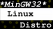

=============================================================================================================================================
 |mpv| MPV Player: Cross-Compil MPV (static) on Linux 32-Bits targetting Windows 32-Bits 
=============================================================================================================================================
-------------------------------------------------------------------------------------------------------------------------------------------------
|MinGW32_Linux_Distro_Logo| GCC 7.2.0 - MinGW-w64 5.0.4  A  MinGW-w64 Prebuilt Toolchain for Linux-32Bits Targetting Win32 (Posix Thread) 
-------------------------------------------------------------------------------------------------------------------------------------------------

:Info:		My Web Site: http://www.davidgis.fr
:Author:	David TECHER, <davidtecher@yahoo.fr>
:Date:		2018-10-13
:Revision:	20181013 05:30:00 CET
:Copyright:     This document has been placed in the public domain.

.. note::

	INFO **This toolchain is dedicated to cross-compil MPV for Windows 32 Bits (at least Windows 7) on a native Linux-32Bits workstation/PC**

		* **More than 90% of built packages are built/linked staticaly** (``--enable-static=yes --enable-shared=no``)
		* Both flags ``--enable-shared`` and ``--enable-static`` are used for GCC but we will try to build only static packages. 
		* If cross-compiling mpv failed and and a DLL is required then we can still have this opportunity to use a DLL.
		* I took decision to use both on a old version of GCC (7.2.0) and to use an old version of binutils. This way, packages are not broken.
		* **I try to follow this guide**  https://github.com/qyot27/mpv/blob/extra-new/DOCS/crosscompile-mingw-tedious.txt **I tried to enhance it by adding more packages (shaderc, crossc, harfbuzz, vulkan, libarchive, rubberband and so on...)**
		* Compared to all toolchains, I could see in the Web (MXE, other dedicated toolchains for MPV), I think it is a good recommendation to build a complete toolchain (GCC +  all its stuffs).
		* This toolchain is built on a real Linux 32-Bits machine (no virtual machine).
		* Toolchain is located -- hardcoded -- at ``/opt/MinGW32`` -- this way it will not interfere with your own system --
		* Its packages are located at ``/opt/MinGW32/packages``

.. sectnum::

.. contents:: Table of contents

Notes regarding this toolchain, its packages and Wine
======================================================
**Packages**

* All packages built from any Git repository are suffixed by ``-git``
* When a package is built from a Git repository, I use a function called  ``_pkgver()`` -- based on Arch --. This function will return both the latest commit and its revision name.
* To reduce disk storage consumption, in all  packages

	- exe files are removed: we don't need them!
	- man files are removed: we don't need them!
	- We try to build only static library avoiding any dynamic library -- as much as we can --

**Wine**

* To avoid any issue while building package, it is strongly recommended not to upgrade wine version while building all packages.
* Wine-Staging 3.15 was used and this version was kept as-it-is while building all packages.
* On my rig:
	
	- ``wine`` is indeed installed at ``/opt/wine/apps/MinGW32_Environment/``
	- My ``WINEPREFIX`` is set to ``/opt/Builds/wine/data/MinGW32_Environment``
	- Since the toolchain is located at ``/opt/MinGW32`` then it means that any exe file should be installed at ``/opt/MinGW32̀/i686-w64-mingw/bin``

Usefull links to build packages
===============================

I strongly recommend to have a look at https://aur.archlinux.org/packages/?SeB=n&K=mingw-w64&SB=c&PP=250 to see if there is any existing package from AUR. Even if there is a PKGBUILD then don't use it :). But it could be useful 

* One of the Official repositories for MPV Windows binaries  https://github.com/shinchiro/mpv-winbuild-cmake
* Outdated repository but pretty interesting to cross-compil MPV https://github.com/soarqin/ffmpeg-mpv-msys2-build
* Official repo for MinGW-w64 https://github.com/Alexpux/MINGW-packages
* AUR (Arch Users Repo) https://aur.archlinux.org
* https://github.com/Warblefly/MultimediaTools-mingw-w64/blob/master/cross_compile_ffmpeg_shared.sh
* https://github.com/rdp/ffmpeg-windows-build-helpers/blob/master/cross_compile_ffmpeg.sh
* http://git.yoctoproject.org/cgit.cgi/meta-mingw
* MXE sources https://github.com/mxe/mxe/tree/master/src 
* Build MPV from a Linux 64 Bits https://github.com/qyot27/mpv/blob/extra-new/DOCS/crosscompile-mingw-tedious.txt
* Build a Toolchain from a Linux 32 Bits inside a virtual machine (Linux 32 Bits) https://github.com/qyot27/mpv/blob/extra-new/DOCS/crosscompile-mingw-tedious_32bit.txt
* Packages of one the guy who provided binaries for MPV on windows https://obs.cirno.systems/project/show/mingw-w64:i686

Toolchain: Download sources
=============================

::

	export MINGW_PREFIX=/opt/MinGW32
	export PATH=${MINGW_PREFIX}/bin:$PATH
	export _host=i686-w64-mingw32
	export _build=i686-pc-linux-gnu
	export _target=i686-w64-mingw32
	export _mingw_prefix=${MINGW_PREFIX}/${_target}

	mkdir /build
	cd /build

	git clone --depth=1 --branch v5.0.4 git://git.code.sf.net/p/mingw-w64/mingw-w64

	wget http://ftp.gnu.org/gnu/binutils/binutils-2.29.1.tar.bz2
	wget ftp://ftp.uvsq.fr/pub/gcc/releases/gcc-7.2.0/gcc-7.2.0.tar.xz
	wget https://ftp.gnu.org/gnu/mpfr/mpfr-4.0.1.tar.gz
	wget https://gmplib.org/download/gmp/gmp-6.1.2.tar.xz
	wget ftp://ftp.gnu.org/gnu/mpc/mpc-1.1.0.tar.gz
	wget http://isl.gforge.inria.fr/isl-0.18.tar.gz

	tar -jxf binutils-2.29.1.tar.bz2
	tar -xf gcc-7.2.0.tar.xz
	tar xf mpc-1.1.0.tar.gz && tar xf mpfr-4.0.1.tar.gz && tar xf gmp-6.1.2.tar.xz && tar xf isl-0.18.tar.gz

	cd mpfr-4.0.1 && \
	wget http://www.mpfr.org/mpfr-4.0.1/allpatches && \
	patch -N -Z -p1 < allpatches

	ln -s /build/mpfr-4.0.1 /build/binutils-2.29.1/mpfr
	ln -s /build/gmp-6.1.2 /build/binutils-2.29.1/gmp
	ln -s /build/mpc-1.1.0 /build/binutils-2.29.1/mpc
	ln -s /build/isl-0.18 /build/binutils-2.29.1/isl

	ln -s /build/gmp-6.1.2 /build/gcc-7.2.0/gmp
	ln -s /build/isl-0.18 /build/gcc-7.2.0/isl
	ln -s /build/mpc-1.1.0 /build/gcc-7.2.0/mpc
	ln -s /build/mpfr-4.0.1 /build/gcc-7.2.0/mpfr

Toolchain: Build
===================

.. note::

	INFO Content of this section is based on 
		* 70% https://developer.mozilla.org/en-US/docs/Mozilla/Developer_guide/Build_Instructions/Cross_Compile_Mozilla_for_Mingw32
		* 20% for GCC options and strip commands to free up disk space https://aur.archlinux.org/cgit/aur.git/tree/PKGBUILD?h=mingw-w64-gcc
		* 10% for binutils options https://aur.archlinux.org/cgit/aur.git/tree/PKGBUILD?h=mingw-w64-binutils

.. note::

	INFO **All commands provided in this section are done being ``root`` user**

Mingw-w64-binutils: Binutils 2.29.1
------------------------------------

::

	mkdir /build/binutils-2.29.1-build32/ && cd /build/binutils-2.29.1-build32/
	/build/binutils-2.29.1/configure --prefix=${MINGW_PREFIX} --build=${_build} --target=${_target} --enable-lto --disable-nls  \
	        --infodir=${MINGW_PREFIX}/share/info/${_target} --enable-plugins --libdir=${MINGW_PREFIX}/lib \
	        --enable-static --disable-shared --disable-multilib --disable-nls --disable-werror --with-system-zlib --enable-libssp --with-sysroot=${MINGW_PREFIX}
	make -j$(nproc) && make install-strip
	ln -s $MINGW_PREFIX/${_target} $MINGW_PREFIX/mingw

MinGW-w64-Headers (ALL + somes patches to build MPV)
--------------------------------------------------------

::

	# Patches for MPV
	cd /build/mingw-w64/mingw-w64-headers/direct-x/
	wget -q "https://raw.githubusercontent.com/Warblefly/MultimediaTools-mingw-w64/master/mingw-w64-headers-d3d11_1.h.patch" -O - | patch -p0
	wget -q "https://raw.githubusercontent.com/Warblefly/MultimediaTools-mingw-w64/master/mingw-w64-headers-dxgi1_2.h.patch" -O - |patch -p0
	wget -q "https://raw.githubusercontent.com/Warblefly/MultimediaTools-mingw-w64/master/mingw-w64-headers-processor_format.patch" -O - |patch -p3
	cd /build/mingw-w64/mingw-w64-headers
	wget -q "http://techer.pascal.free.fr/mingw-w64-headers-D3D11_UAV_FLAG.patch" -O - | patch -p0
	cd /build/mingw-w64/mingw-w64-headers/crt
	wget -q "https://raw.githubusercontent.com/Warblefly/MultimediaTools-mingw-w64/master/mingw-w64-headers-math.h.patch" -O - |patch -p1
	
	
	cd /build/mingw-w64/mingw-w64-headers
	/build/mingw-w64/mingw-w64-headers/configure --host=${_host} --build=${_build}  --prefix=$MINGW_PREFIX/$_target/ --includedir=$MINGW_PREFIX/$_target/include \
		--enable-sdk=all --enable-secure-api --enable-idl
	make -j$(nproc)  && make install-strip

Mingw-w64-gcc: GCC 7.2.0 - Pass #01
------------------------------------

::

	mkdir /build/gcc-7.2.0-mingw32 && cd /build/gcc-7.2.0-mingw32
	/build/gcc-7.2.0/configure --prefix=$MINGW_PREFIX --target=${_target}  --disable-shared --enable-static --disable-multilib --enable-threads=posix  \
		--enable-fully-dynamic-string --enable-libstdcxx-time=yes --enable-lto --enable-languages=c,c++,objc,obj-c++,fortran,lto --with-system-zlib \
		--disable-libstdcxx-verbose --enable-cloog-backend=isl --disable-dw2-exceptions --disable-nls --enable-libgomp --enable-checking=release  \
		--with-sysroot=${MINGW_PREFIX}  --with-as=$MINGW_PREFIX/bin/${_target}-as --with-ld=$MINGW_PREFIX/bin/${_target}-ld 
	make -j4 all-gcc && make install-strip-gcc

MinGW-w64-runtime (Runtime: ALL)
---------------------------------

::

	mkdir /build/mingw-w64-crt32 && cd /build/mingw-w64-crt32
	 /build/mingw-w64/mingw-w64-crt/configure --host=${_target} --prefix=${MINGW_PREFIX}/${_target}/ --with-sysroot=${MINGW_PREFIX} --enable-wildcard --enable-experimental=registeredprintf --enable-delay-import-libs --enable-private-exports
	make -j$(nproc)  && make install-strip

MinGW-w64-Libraries: winpthreads
--------------------------------

:: 

	for library in winpthreads
	do
        	mkdir -pv /build/mingw-w64-$library &&  cd /build/mingw-w64-$library
	        /build/mingw-w64/mingw-w64-libraries/$library/configure --host=${_target} --prefix=${MINGW_PREFIX}/${_target}/  --disable-shared --enable-static --with-sysroot=${MINGW_PREFIX}
        	make -j$(nproc)  && make install && make install-strip
	done

Mingw-w64-gcc: GCC 7.2.0 - Pass #02
------------------------------------

::

	cd /build/gcc-7.2.0-mingw32/
	make -j$(nproc) all && make install && make install-strip
	# Everything should be already stripped properly. But for the peace of mind, just try to strip it again :)
	strip -v ${MINGW_PREFIX}/bin/${_target}-*
	strip -v ${MINGW_PREFIX}/libexec/gcc/i686-w64-mingw32/7.2.0/{cc1*,collect2,f951,lto*}

MinGW-w64-Libraries: pseh, winstorecompat
-------------------------------------------

:: 

	for library in pseh winstorecompat
	do
	        mkdir -pv /build/mingw-w64-$library && cd /build/mingw-w64-$library
	        /build/mingw-w64/mingw-w64-libraries/$library/configure --host=${_target} --prefix=${MINGW_PREFIX}/${_target}/  > build.log 2>&1
	        make -j$(nproc)  >> build.log 2>&1 &&  make install-strip >> build.log 2>&1
	done

MinGW-w64-Tools: gendef, genidl, genlib, genpeimg, i686-w64-mingw32-widl
------------------------------------------------------------------------

::

	for tools in gendef genidl genlib genpeimg;
	do
	        mkdir -pv /build/mingw-w64-tools32/build-$tools
	        cd /build/mingw-w64-tools32/build-$tools
	        /build/mingw-w64/mingw-w64-tools/$tools/configure --prefix=${MINGW_PREFIX}
	        make -j$(nproc) && make install-strip
	done

	cd /build
	mkdir widl32 && cd widl32
	/build/mingw-w64/mingw-w64-tools/widl/configure --prefix=${MINGW_PREFIX} --target=${_target} --includedir=$PREFIX/${_target}/include
	make -j$(nproc) && make install-strip

MinGW-w64-ExtraTools: i686-w64-mingw32-pkg-config (based on pkgconf)
----------------------------------------------------------------------------
I took decision to give a try to ``pkgconf`` instead of using the well-known ``pkg-config``.

::

	cd /build
        wget https://distfiles.dereferenced.org/pkgconf/pkgconf-1.5.3.tar.xz
        tar xvJf pkgconf-1.5.3.tar.xz 
        cd pkgconf-1.5.3
        ./configure --prefix=$MINGW_PREFIX/$_target  --with-sysroot=$MINGW_PREFIX/  \
                --with-pkg-config-dir=$MINGW_PREFIX/$_target/lib/pkgconfig \
                --with-system-libdir=$MINGW_PREFIX/$_target/lib \
                --with-system-includedir=$MINGW_PREFIX/$_target/include
        make -j$(nproc) && make install-strip
        ln -s $MINGW_PREFIX/$_target/bin/pkgconf $MINGW_PREFIX/bin/${_target}-pkg-config

MinGW-w64-ExtraTools: Mingw-w64-cmake, mingw-w64-makeself, mingw-w64-meson, mingw-w64-makeself-MinGW32-Distro
-----------------------------------------------------------------------------------------------------------------------------------------------------------------------------------

.. note::

	INFO ``WINEPATH`` is filled in ``/opt/MinGW32/bin/i686-w64-mingw32-wine``. Don't forget to modify its value to point to your local wine location.

:: 

 export PREFIX=/opt/MinGW32
 export target=i686-w64-mingw32
 cat << _EOF_ > $PREFIX/README
 ##################################################################################################################
 #
 #            MinGW64: Prebuilt Toolchain for Linux-32Bits Targetting Win32 (Posix Thread)
 #
 ##################################################################################################################
 #
 # You have to source this file to set up the environment. By default it should be installed at /opt/MinGW32
 #	
 # Note: if wine is installed on your system then you have to modify the file /opt/MinGW32/bin/i686-w64-mingw32-wine 
 #
 # - GCC 7.2.0: 
 #		Thread Posix, 
 #		Languages c,lto,c++,objc,obj-c++,fortran
 # - MinGW-w64 5.0.4 (Headers, CRT,  Tools and Libraries)
 #
 # For more information, please refer to https://github.com/rboxeur/mpv-i686-cross-compiling-MinGW32-Doc
 # 
 _EOF_
	

 chmod 777 $PREFIX/bin/$target-pkg-config
 cat << _EOF_ > $PREFIX/bin/dlltool
 $PREFIX/bin/$target-dlltool --as=$PREFIX/bin/$target-as "\$@"
 _EOF_
 
 chmod 777 $PREFIX/bin/dlltool
 
 # * Script: mingw-w64-cmake
 # 
 mkdir -pv $PREFIX/share/cmake/Toochains;
 wget "https://aur.archlinux.org/cgit/aur.git/plain/toolchain-mingw.cmake?h=mingw-w64-cmake" -O  - |sed -e "s:@PROCESSOR@:${target:0:4}:g;s:@TRIPLE@:${target}:g;s:/usr:${PREFIX}:g" > $PREFIX/share/cmake/Toochains/toolchain-MinGW32.cmake
 wget "https://aur.archlinux.org/cgit/aur.git/plain/mingw-cmake.sh?h=mingw-w64-cmake" -O - | sed -e "s:@TRIPLE@:${target}:g;s:/usr:${PREFIX}:g;s:/opt/MinGW32/share/mingw/toolchain-i686-w64-mingw32.cmake:$PREFIX/share/cmake/Toochains/toolchain-MinGW32.cmake:g" > $PREFIX/bin/mingw-w64-cmake
 
 #wget "https://aur.archlinux.org/cgit/aur.git/plain/mingw-wine.sh?h=mingw-w64-wine" -O - | sed -e "s:@TRIPLE@:${target}:g;s:/usr:${PREFIX}:g;s:export WINEPATH.*:export WINEPATH=/opt/wine/apps/MinGW32_Environment/bin/:g" > $PREFIX/bin/$target-wine
 wget "https://aur.archlinux.org/cgit/aur.git/plain/mingw-wine.sh?h=mingw-w64-wine" -O - | sed -e "s:@TRIPLE@:${target}:g;s:/usr:${PREFIX}:g;s:export WINEPATH.*:export WINEPATH=/opt/wine/apps/MinGW32_Environment/bin/:g;s:$PREFIX/bin/wine:/opt/wine/apps/MinGW32_Environment/bin/wine:g"  > $PREFIX/bin/$target-wine
 
 chmod 777 $PREFIX/bin/mingw-w64-cmake
 chmod 777 $PREFIX/bin/$target-wine
 sed -i "s:-DBUILD_SHARED_LIBS\:BOOL=ON:-DBUILD_SHARED_LIBS\:BOOL=OFF:g" $PREFIX/bin/mingw-w64-cmake
 # 
 # * Script: mingw-w64-makeself-MinGW32-Distro => To back up the content of /opt/MinGW32
 #
 wget http://techer.pascal.free.fr/mingw-w64-makeself-MinGW32-Distro -O $PREFIX/bin/mingw-w64-makeself-MinGW32-Distro
 chmod 777 $PREFIX/bin/mingw-w64-makeself-MinGW32-Distro

 #
 # * Script: mingw-w64-makeself => to generate a package using makeself
 wget http://techer.pascal.free.fr/mingw-w64-makeself -O $PREFIX/bin/mingw-w64-makeself
 chmod 777 $PREFIX/bin/mingw-w64-makeself

 # Update version for MinGW-w64
 sed -i "s:5\.0\.3:5\.0\.4:" /opt/MinGW32/bin/mingw-w64-makeself*
 
 # * Script:  mingw-w64-meson
 #	
 [ ! -d /tmp/sources ] && mkdir -p /tmp/sources  
 cd /tmp/sources/
 git clone https://aur.archlinux.org/mingw-w64-meson.git
 cd mingw-w64-meson/

 [ ! -d "$PREFIX/share/mingw" ] && { mkdir -pv "$PREFIX/share/mingw"; }
 sed -e "s:@TRIPLE@:${PREFIX}/bin/${target}:g;s:@CPU_FAMILY@:x86:g;s:@PROCESSOR@:x86:g;s:root =.*:root = '${target}':g" toolchain-mingw.meson > toolchain-${target}.meson 
 sed -e "s:@TRIPLE@:${PREFIX}/bin/${target}:g;s:@CPU_FAMILY@:x86:g;s:@PROCESSOR@:x86:g;s:root =.*:root = '${target}':g" toolchain-mingw.meson > toolchain-${target}-wine.meson
 sed -i '/^exe_wrapper/ d' toolchain-${target}.meson
 sed -e "s:/usr:${PREFIX}:g;s:@TRIPLE@:${target}:g;s:/var:${PREFIX}/${target}/var:g" meson-mingw-wrapper > ${target}-meson

 install -m755 ${target}-meson $PREFIX/bin
 install -m644 toolchain-${target}.meson $PREFIX/share/mingw
 install -m644 toolchain-${target}-wine.meson $PREFIX/share/mingw

 mkdir $PREFIX/packages
 chmod 777 -R $PREFIX

Additional steps
================

Cmake 3.12.3 or greater (optional)
----------------------------------

.. note::

        INFO If your cmake version -- provided by your package (apt, yum etc) -- is too old then you can build a recent cmake version using commands below

::

	cd /build
	export PREFIX="/opt/MinGW32"
	wget https://cmake.org/files/v3.12/cmake-3.12.3.tar.gz -O - | tar xvzf - && cd cmake-3.12.3
	./configure --prefix=$PREFIX --parallel=$(nproc) --no-system-libs --no-system-curl --no-system-expat \
	        --no-system-jsoncpp --no-system-zlib --no-system-bzip2 --no-system-liblzma --no-system-libarchive \
	        --no-system-librhash --no-system-libuv --no-qt-gui
	make -j$(nproc) && make install
	strip $PREFIX/bin/cmake
	strip $PREFIX/bin/cmake
	strip $PREFIX/bin/ccmake
	strip $PREFIX/bin/cpack
	strip $PREFIX/bin/ctest

Source your MinGW32 environment
---------------------------------
::

 _initdir(){ # Reset all MinGW environment variables and get back into ${SRCDIR}
	 #
	 # MinGW - Environment variables
         #______________________________
         export PREFIX="/opt/MinGW32"
         export target="i686-w64-mingw32"

	 # flags for compilers and linkers
         export CPPFLAGS="-I${PREFIX}/${target}/include"
         export LDFLAGS="-L${PREFIX}/${target}/lib"
         export mingw_c_flags="-O2 -g -pipe -Wall -Wp,-D_FORTIFY_SOURCE=2 -fexceptions --param=ssp-buffer-size=4" 
         export CFLAGS="$mingw_c_flags $CFLAGS"
         export CXXFLAGS="$mingw_c_flags $CXXFLAGS"
	 
	 # Pkg-config and co
         export PKG_CONFIG="${PREFIX}/bin/${target}-pkg-config"
         export PKG_CONFIG_LIBDIR="${PREFIX}/${target}/lib/pkgconfig"
         export PKG_CONFIG_PATH="${PREFIX}/${target}/lib/pkgconfig/"
	 
	 # Working folders 
         export SRCDIR="/TMP_MinGW32/sources" # where to download the sources and to build them
         export DESTDIR="/TMP_MinGW32/build"  # where to temporary copy files before building packages
	 
         export CC=${PREFIX}/bin/${target}-gcc
         export CXX=${PREFIX}/bin/${target}-g++
         export CPP=${PREFIX}/bin/${target}-cpp

         export LD=${PREFIX}/bin/${target}-ld
         export NM=${PREFIX}/bin/${target}-nm
         export STRIP=${PREFIX}/bin/${target}-strip
         export AR=${PREFIX}/bin/${target}-ar
         export RANLIB=${PREFIX}/bin/${target}-ranlib
         export AS=${PREFIX}/bin/${target}-as
         export DLLTOOL=${PREFIX}/bin/dlltool
         export OBJDUMP=${PREFIX}/bin/${target}-objdump
         export DLLWRAP=${PREFIX}/bin/${target}-dllwrap

	 export RESCOMP=${PREFIX}/bin/${target}-windres
         export WINDRES=${PREFIX}/bin/${target}-windres
         export RC=${PREFIX}/bin/${target}-windres

	# Extra
         export EXEEXT=".exe" # Required for some packages like MuJS	
 
         [ ! -d "${SRCDIR}" ] && { mkdir -p "${SRCDIR}"; } || { cd "${SRCDIR}"; } && { cd "${SRCDIR}"; }
 }

 _pkgver() { # Git repository: Prints the current version and latest commit. Pretty useful to maintain packages
         ( git describe --long --tags > /dev/null 2>&1 ) && \
         { _version=$( git describe --long --tags | sed 's/\([^-]*-g\)/r\1/;s/-/./g;s/^v//' );  } || \
         { _version=$(printf "r%s.%s" "$(git rev-list --count HEAD)" "$(git rev-parse --short HEAD)"); }
 
          _gitcommit=$(git log | head -n1 | awk '{print $2}' )
         echo "# version = $_version";
         echo "# commit = $_gitcommit";
 }

 _get_missing_dll_at_runtime()
 {
         my_file="${1}"
         local my_path="/opt/MinGW32/i686-w64-mingw32/bin"
 
         [ ! -f "${my_file}" ] && { echo "not a regular file!"; exit 1; }
 
         for file in $(objdump -p ${my_file} |grep "DLL Name"|awk '{print $NF}'|sort);
         do  
                 [ -f "${my_path}/${file}" ] && echo "${my_path}/${file}" || echo "# not found: ${file}";
         done
 }

 _prepare_package() #  We just want a package with libraries, headers files, and pkgconfig folders
 {
	 # Re-added some environment variables so they stay as-they-are.
	 export PREFIX="/opt/MinGW32"
	 export target="i686-w64-mingw32"
	 export SRCDIR="/TMP_MinGW32/sources"
	 export DESTDIR="/TMP_MinGW32/build"

	 # Try 'install-strip' first else try usual 'install' option
         make DESTDIR=$DESTDIR install-strip || make DESTDIR=$DESTDIR install
 
	 # Remove unneeded folders.	
         for dir in man doc info gtk-doc;do [ -d "$DESTDIR/$PREFIX/$target/share/${dir}" ] && { rm -rf "$DESTDIR/$PREFIX/$target/share/${dir}"; };done
 
	 # Removed unneeded files and binaries	
         find $DESTDIR/$PREFIX/$target/ -name '*.png'  -exec rm -vf  {} \;
         find $DESTDIR/$PREFIX/$target/ -name '*.gif'  -exec rm -vf  {} \;
         find $DESTDIR/$PREFIX/$target/ -name '*.html' -exec rm -vf  {} \;
         find $DESTDIR/$PREFIX/$target/ -name '*.exe'  -exec rm -vf  {} \;

	 # Strip both dynamic libraries and static libraries 
         find $DESTDIR/$PREFIX/$target/ -name '*.dll'  -exec ${PREFIX}/bin/${target}-strip --strip-unneeded {} \;
         find $DESTDIR/$PREFIX/$target/ -name '*.a'    -exec ${PREFIX}/bin/${target}-strip -g {} \;
 }
 
 # Add MinGW to to beginning of the PATH
 export PREFIX="/opt/MinGW32"
 export target="i686-w64-mingw32"

 export PATH=${PREFIX}/bin:${PATH}

After that 

::

	sudo mkdir /TMP_MinGW32/{build,sources}
	sudo chown $USER /TMP_MinGW32/{build,sources}

Core Packages 
=========================

.. note::

	INFO All packages will be built inside ``SRCDIR=/TMP_MinGW32/sources`` folder and temporary installed in ``DESTDIR=/TMP_MinGW32/build``. A couple of packages are built using instruction from ``Arch``.
	
	* These packages are self-extractable archives, generated using makeself (https://github.com/megastep/makeself). ``makeself`` aims at generating self-extractable package.

Dlfcn (Win32) 1.1.2
----------------------
* URL https://aur.archlinux.org/packages/mingw-w64-dlfcn

::

        _initdir 

        wget https://github.com/dlfcn-win32/dlfcn-win32/archive/v1.1.2.tar.gz -O - | tar xvzf - && cd dlfcn-win32-1.1.2/
        ./configure --prefix=$PREFIX/$target/ --libdir=$PREFIX/$target/lib --incdir=$PREFIX/$target/include --disable-shared --enable-static --cross-prefix=$target-
        make -j$(nproc)

        _prepare_package
        cp -avf $DESTDIR/$PREFIX/$target/* $PREFIX/$target/
        mingw-w64-makeself dlfcn 1.1.2 $DESTDIR/$PREFIX/$target delete

Zlib 1.2.11
-----------

* URL https://aur.archlinux.org/packages/mingw-w64-zlib/

::

        _initdir

        wget http://zlib.net/zlib-1.2.11.tar.gz -O - | tar xvzf - && cd zlib-1.2.11
        wget "https://raw.githubusercontent.com/lachs0r/mingw-w64-cmake/master/packages/zlib-1-win32-static.patch" -O - |patch -p1
        CFLAGS="$CFLAGS" CC=$CC AR=$AR RANLIB=$RANLIB ./configure --prefix=$PREFIX/$target --static
        make -j$(nproc)

        _prepare_package
        cp -avf $DESTDIR/$PREFIX/$target/* $PREFIX/$target
        mingw-w64-makeself zlib 1.2.11 $DESTDIR/$PREFIX/$target delete
        
Bzip2 1.0.6
------------------

* URL https://aur.archlinux.org/cgit/aur.git/tree/PKGBUILD?h=mingw-w64-bzip2

::

        _initdir

        wget https://src.fedoraproject.org/lookaside/pkgs/bzip2/bzip2-1.0.6.tar.gz/00b516f4704d4a7cb50a1d97e6e8e15b/bzip2-1.0.6.tar.gz -O - | tar xvzf - && cd bzip2-1.0.6/
        git clone https://aur.archlinux.org/mingw-w64-bzip2.git && cd mingw-w64-bzip2 && git checkout 85d025dd80aef7dd360ef7cd02ef8222aaf773ab && cd $SRCDIR/bzip2-1.0.6/
        patch -p1 -i ${SRCDIR}/mingw-w64-bzip2/bzip2-1.0.5-autoconfiscated.patch 
        patch -p1 -i ${SRCDIR}/mingw-w64-bzip2/bzip2-use-cdecl-calling-convention.patch
        patch -p1 -i ${SRCDIR}/mingw-w64-bzip2/mingw32-bzip2-1.0.5-slash.patch 
        sh autogen.sh 
        ./configure --host=$target --prefix=$PREFIX/$target --enable-static --disable-shared --with-sysroot=$PREFIX
        make -j4

        _prepare_package
        rm -rf $DESTDIR/$PREFIX/$target/bin/*
        cp -avf $DESTDIR//$PREFIX/$target/* $PREFIX/$target/
        mingw-w64-makeself bzip2 1.0.6 $DESTDIR/$PREFIX/$target delete

Xz 5.2.4
----------
* URL https://aur.archlinux.org/packages/mingw-w64-xz/

:: 

        _initdir

        wget --no-check-certificate http://tukaani.org/xz/xz-5.2.4.tar.gz -O - | tar xvzf - && cd xz-5.2.4/
        ./configure --host=$target  --prefix=$PREFIX/$target/  --disable-shared --enable-static --disable-nls --enable-silent-rules
        make -j$(nproc) 

        _prepare_package
        cp -avf $DESTDIR/$PREFIX/$target/* $PREFIX/$target/
        mingw-w64-makeself xz 5.2.4 $DESTDIR/$PREFIX/$target delete

Lzo 2.10
----------

* URL https://aur.archlinux.org/packages/mingw-w64-lzo

::

        _initdir

        wget http://www.oberhumer.com/opensource/lzo/download/lzo-2.10.tar.gz -O - | tar xvzf - && cd lzo-2.10/
        make distclean # to clean up sources
        mkdir build && cd build
        ../configure --host=$target  --prefix=$PREFIX/$target/  --disable-shared --enable-static
        make -j$(nproc) 

        _prepare_package
        cp -avf $DESTDIR/$PREFIX/$target/* $PREFIX/$target/
        mingw-w64-makeself lzo 2.10 $DESTDIR/$PREFIX/$target delete

Snappy-git 1.1.7.r15.gea660b5
-----------------------------------

::

        _initdir

        git clone git://github.com/google/snappy.git && cd snappy

        _pkgver
        # version = 1.1.7.r15.gea660b5
        # commit = ea660b57d65d68d521287c903459b6dd3b2804d0
        
        mkdir build-$target && cd build-$target
        mingw-w64-cmake .. -DBUILD_SHARED_LIBS=OFF -DSNAPPY_BUILD_TESTS:bool=OFF  -DCMAKE_SYSROOT=$PREFIX
        make -j$(nproc)

        _prepare_package
        cp -avf $DESTDIR/$PREFIX/$target/* $PREFIX/$target/
        mingw-w64-makeself snappy-git 1.1.7.r15.gea660b5 $DESTDIR/$PREFIX/$target delete

Lcms2-basic-git 2.9.r24.g32f0c45 (aka LCMS2-Basic)
-----------------------------------------------------

::

        _initdir

        git clone git://github.com/mm2/Little-CMS.git && cd Little-CMS

        _pkgver
        # version = lcms2.9.r24.g32f0c45
        # commit = 32f0c458c910a033375c57b46d7a3c1c606e6cbc
        
        ./configure --host=$target  --prefix=$PREFIX/$target/  --disable-shared --enable-static  --without-jpeg --without-tiff --enable-silent-rules
        make -j$(nproc)

        _prepare_package
        cp -avf $DESTDIR/$PREFIX/$target/* $PREFIX/$target/
        mingw-w64-makeself lcms2-basic-git 2.9.r24.g32f0c45 $DESTDIR/$PREFIX/$target delete

Giflib 5.1.4
-----------------------------------------

::

        _initdir

        wget http://downloads.sourceforge.net/project/giflib/giflib-5.1.4.tar.bz2 -O - | tar -xjvf - && cd giflib-5.1.4
        ./configure --host=$target  --prefix=$PREFIX/$target/  --disable-shared --enable-static --with-sysroot=$PREFIX  
        make -j$(nproc)

        _prepare_package
        cp -avf $DESTDIR/$PREFIX/$target/* $PREFIX/$target/
        mingw-w64-makeself giflib 5.1.4 $DESTDIR/$PREFIX/$target delete

Libjpeg-turbo-git 2.0.0.r11.g504a295
-----------------------------------------------------------

::

        _initdir

        git clone git://github.com/libjpeg-turbo/libjpeg-turbo && cd libjpeg-turbo

        _pkgver
	# version = 2.0.0.r11.g504a295
	# commit = 504a295cde32ac42625f47d0804e0ca9e55677ce

        mkdir build-$target && cd build-$target 
        mingw-w64-cmake  .. -DENABLE_SHARED:bool=off -DWITH_12BIT:bool=on -DCMAKE_SYSTEM_PROCESSOR="i686"
        make -j$(nproc)

        _prepare_package
        cp -avf $DESTDIR/$PREFIX/$target/* $PREFIX/$target/
        mingw-w64-makeself libjpeg-turbo-git 2.0.0.r11.g504a295 $DESTDIR/$PREFIX/$target delete

Libpng-git 1.6.29-r5.g7292c86
-------------------------------------------------------

::

        _initdir
        
        git clone git://git.code.sf.net/p/libpng/code libpng && cd libpng
        
        _pkgver
        # version = libpng.1.6.29.master.signed.r5.g7292c86
        # commit = 7292c861b165ae4279267083e273aa31b7e42004

        sed -i 's/ASM C/C ASM/' CMakeLists.txt 
        mkdir build-$target && cd build-$target
        mingw-w64-cmake .. -DPNG_SHARED:bool=off -DPNG_TESTS:bool=off
        make -j$(nproc)

        _prepare_package
        cp -avf $DESTDIR/$PREFIX/$target/* $PREFIX/$target/
        ln -s $PREFIX/$target/bin/libpng-config $PREFIX/bin/ # Adding a symbolic link to the main MinGW prefix
        ln -s $PREFIX/$target/bin/libpng16-config $PREFIX/bin/ # Adding a symbolic link to the main MinGW prefi
        mingw-w64-makeself libpng-git 1.6.29-r5.g7292c86 $DESTDIR/$PREFIX/$target delete

Jbigkit-git 2.1.r16.g2281149
-------------------------------------------------

::

        _initdir

        git clone git://github.com/qyot27/jbigkit.git && cd jbigkit

        _pkgver
        # version = 2.1.r16.g2281149
        # commit = 2281149c0b8f156c5dcdfa76d9077d4362ccb9a8

        git checkout mingw-w64
        autoreconf -fiv

        ./configure --host=$target  --prefix=$PREFIX/$target/  --disable-shared --enable-static --with-sysroot=$PREFIX --enable-silent-rules
        make -j$(nproc)

        _prepare_package
        cp -avf $DESTDIR/$PREFIX/$target/* $PREFIX/$target/
        mingw-w64-makeself jbigkit-git 2.1.r16.g2281149 $DESTDIR/$PREFIX/$target delete

Openjpeg 2.3.0
-------------------------------------

::

        _initdir

        wget https://github.com/uclouvain/openjpeg/archive/v2.3.0.tar.gz -O - | tar -xzvf - && cd openjpeg-2.3.0/
        mkdir build-$target && cd build-$target
        mingw-w64-cmake .. -DBUILD_SHARED_LIBS:bool=off -DBUILD_MJ2:bool=on -DBUILD_JPWL:bool=on  -DBUILD_THIRDPARTY:bool=on -DBUILD_PKGCONFIG_FILES:bool=on
        make -j$(nproc)

        _prepare_package
        cp -avf $DESTDIR/$PREFIX/$target/* $PREFIX/$target/
        mingw-w64-makeself openjpeg 2.3.0 $DESTDIR/$PREFIX/$target delete

Libtiff-git 4.0.9.r106.gd438fab
-----------------------------------------
::

        _initdir

        git clone https://gitlab.com/libtiff/libtiff.git && cd libtiff

        _pkgver
        # version = Release.v4.0.9.r106.gd438fab
        # commit = d438fab328c0e6180f27610df532340a73694023

        autoreconf -fvi
        #mkdir build-$target && cd build-$target
        #mingw-w64-cmake .. -DBUILD_SHARED_LIBS:bool=off
        ./configure  --host=$target  --prefix=$PREFIX/$target/ --enable-cxx --enable-static --disable-shared
        make -j$(nproc)

        _prepare_package
        cp -avf $DESTDIR/$PREFIX/$target/* $PREFIX/$target/
        mingw-w64-makeself libtiff-git 4.0.9.r106.gd438fab $DESTDIR/$PREFIX/$target delete

Libwebp-git 1.0.0.r76.gef1094b
---------------------------------

::

        _initdir

        git clone https://chromium.googlesource.com/webm/libwebp && cd libwebp

        _pkgver
	# version = 1.0.0.r76.gef1094b
	# commit = ef1094b0fef9fd8492e19e00979e560105f7d20e

        autoreconf -fiv
        ac_cv_path_LIBPNG_CONFIG="${PREFIX}/bin/libpng16-config --static" LIBS="-llzma -ljbig -ljpeg" ./configure --host=$target  --prefix=$PREFIX/$target/  \
        --disable-shared --enable-static --with-sysroot=$PREFIX --enable-silent-rules --enable-swap-16bit-csp --enable-tiff --enable-libwebpmux --enable-libwebpdemux --enable-libwebpdecoder
        make -j$(nproc)

        _prepare_package
        cp -avf $DESTDIR/$PREFIX/$target/* $PREFIX/$target/
        mingw-w64-makeself libwebp-git 1.0.0.r76.gef1094b $DESTDIR/$PREFIX/$target delete

Lcms2-full-git 2.9.r24.g32f0c45
------------------------------------

::

        _initdir

        cd Little-CMS # Make sure to use the same version while building the minimalist package
        git clean -xdf
        mkdir build-$target && cd build-$target
        LIBS="-llzma -ljbig -ljpeg" ../configure --host=$target  --prefix=$PREFIX/$target/  --disable-shared --enable-static --enable-silent-rules --with-sysroot=$PREFIX
        make -j$(nproc) 

        _prepare_package
        cp -avf $DESTDIR/$PREFIX/$target/* $PREFIX/$target/
        mingw-w64-makeself lcms2-full-git 2.9.r24.g32f0c45 $DESTDIR/$PREFIX/$target delete

Libiconv 1.15
------------------------------
::

        _initdir

        wget http://ftp.gnu.org/pub/gnu/libiconv/libiconv-1.15.tar.gz -O - | tar -xzvf - && cd libiconv-1.15
        ./configure --host=$target  --prefix=$PREFIX/$target/  --disable-shared --enable-static --enable-silent-rules --with-sysroot=$PREFIX
        make -j$(nproc)

        _prepare_package
        cp -avf $DESTDIR/$PREFIX/$target/* $PREFIX/$target/
        mingw-w64-makeself libiconv 1.15 $DESTDIR/$PREFIX/$target delete        

Enca-git 1.19.r10.gebcbd60
---------------------------
::

        _initdir
        
        git clone git://github.com/nijel/enca.git && cd enca

        _pkgver
        # version = 1.19.r10.gebcbd60
        # commit = ebcbd6001a332f7294346de99afe69529839dc6e

        sed -i -e 's/encodings.dat make_hash/encodings.dat make_hash$(EXEEXT)/' -e 's/\.\/make_hash/\.\/make_hash$(EXEEXT)/' tools/Makefile.in
        ./configure --host=$target  --prefix=$PREFIX/$target/  --disable-shared --enable-static --enable-silent-rules --with-sysroot=$PREFIX
        make -j$(nproc) && rm -vf enca.spec

        _prepare_package
        cp -avf $DESTDIR/$PREFIX/$target/* $PREFIX/$target/
        mingw-w64-makeself enca-git 1.19.r10.gebcbd60  $DESTDIR/$PREFIX/$target delete

Freetype 2.9.1
----------------
::

        _initdir

        git clone https://aur.archlinux.org/mingw-w64-freetype2-bootstrap.git && cd mingw-w64-freetype2-bootstrap && git checkout e4d84453385594c1c0e5cde5286fa4edecf57e69 && cd ${SRCDIR}
        wget http://download.savannah.gnu.org/releases/freetype/freetype-2.9.1.tar.gz -O - | tar -xzvf - && cd freetype-2.9.1
        patch -p1 -i $SRCDIR/mingw-w64-freetype2-bootstrap/0001-Enable-table-validation-modules.patch
        patch -p1 -i $SRCDIR/mingw-w64-freetype2-bootstrap/0002-Enable-infinality-subpixel-hinting.patch
        patch -p1 -i $SRCDIR/mingw-w64-freetype2-bootstrap/0003-Enable-long-PCF-family-names.patch
        
        ./configure --host=$target  --prefix=$PREFIX/$target/  --disable-shared --enable-static --with-sysroot=$PREFIX
        make -j$(nproc)

        _prepare_package
        cp -avf $DESTDIR/$PREFIX/$target/* $PREFIX/$target/
        mingw-w64-makeself freetype 2.9.1 $DESTDIR/$PREFIX/$target delete

C2man-git (native Linux package)
------------------------------------
::

	_initdir

	git clone git://github.com/fribidi/c2man.git && cd c2man
	./Configure -d
	make -j$(nproc)
	sudo make install
	
Fribidi 1.0.5
------------------------------
::

        _initdir

        wget https://github.com/fribidi/fribidi/releases/download/v1.0.5/fribidi-1.0.5.tar.bz2 -O - | tar xvjf - && cd fribidi-1.0.5
        ./autogen.sh --prefix=$PREFIX/$target --host=$target --enable-shared=no --enable-static=yes --with-sysroot=$PREFIX --disable-deprecated --disable-debug 
        make -j$(nproc)

        _prepare_package
        cp -avf $DESTDIR/$PREFIX/$target/* $PREFIX/$target/
        mingw-w64-makeself fribidi 1.0.5 $DESTDIR/$PREFIX/$target delete

Expat 2.2.6
--------------------------
::

        _initdir

        wget https://github.com/libexpat/libexpat/releases/download/R_2_2_6/expat-2.2.6.tar.bz2 -O - |tar xvjf - && cd expat-2.2.6/
        mingw-w64-cmake . -DBUILD_tests:bool=off -DBUILD_examples:bool=off -DBUILD_tools:bool=off -DBUILD_shared:bool=off
        make -j$(nproc) 

        _prepare_package
        cp -avf $DESTDIR/$PREFIX/$target/* $PREFIX/$target/
        mingw-w64-makeself expat 2.2.6 $DESTDIR/$PREFIX/$target delete

Jsonc-c-git r747.994e6c1
--------------------------------------------
::

        _initdir

        git clone git://github.com/json-c/json-c.git && cd json-c       
        
        _pkgver
        # version = r747.994e6c1
        # commit = 994e6c1f6030a052429c50a917a3991c5e2e7646

        ./autogen.sh --prefix=$PREFIX/$target --host=$target --enable-shared=no --enable-static=yes --with-sysroot=$PREFIX 
        make -j$(nproc)
        
        _prepare_package
        cp -avf $DESTDIR/$PREFIX/$target/* $PREFIX/$target/
        mingw-w64-makeself json-c-git r747.994e6c1 $DESTDIR/$PREFIX/$target delete

Fontconfig-git 2.12.6.r5.g665584a
------------------------------------
::

        _initdir

        git clone git://anongit.freedesktop.org/fontconfig && cd fontconfig
        git checkout fc-2-12 

        _pkgver
        # version = 2.12.6.r5.g665584a
        # commit = 665584a19b0ec227c93643ffb0540d11ac8ecf7f
        
        autoreconf -fiv
        sed -i 's/cross_compiling=no/cross_compiling=yes/g' configure
        PKG_CONFIG="${PREFIX}/bin/${target}-pkg-config --static"   ./configure --prefix=$PREFIX/$target --host=$target --enable-shared=no --enable-static=yes 
        make -j$(nproc)

        _prepare_package
        cp -avf $DESTDIR/$PREFIX/$target/* $PREFIX/$target/
        mingw-w64-makeself fontconfig-git 2.12.6.r5.g665584a $DESTDIR/$PREFIX/$target delete    

Uchardet-git  0.0.6.r58.gbdfd611
------------------------------------
::

        _initdir

        git clone git://anongit.freedesktop.org/uchardet/uchardet.git && cd uchardet

        _pkgver
        # version = 0.0.6.r58.gbdfd611
        # commit = bdfd6116a965fd210ef563613763e724424728b7

        sed -i '74s/^/#/' CMakeLists.txt
        mkdir build-$target && cd build-$target
        mingw-w64-cmake .. -DCMAKE_BUILD_TYPE=Release -DCMAKE_SYSTEM_PROCESSOR="i686" -DBUILD_SHARED_LIBS=OFF
        make -j$(nproc)

        _prepare_package
        cp -avf $DESTDIR/$PREFIX/$target/* $PREFIX/$target/
        mingw-w64-makeself uchardet-git 0.0.6.r58.gbdfd611 $DESTDIR/$PREFIX/$target delete 

Lua-git 5.2.4.r0.g9864851
-------------------------------
::

 _initdir

 git clone git://github.com/LuaDist/lua.git && cd lua && git checkout lua-5.2
        
 _pkgver
 # version = 5.2.4.r0.g9864851
 # commit = 98648514bf7c15d12ccb56222a85e06bfcf9317f

 LUAPACKVER=$(grep version dist.info | cut -f2 -d "\"")
 mkdir build-$target && cd build-$target
 mingw-w64-cmake .. -DCMAKE_RC_FLAGS="-F pe-i386" -DBUILD_SHARED_LIBS:bool=off
 make -j$(nproc)

 _prepare_package
        
 mkdir $DESTDIR/$PREFIX/$target/lib/pkgconfig/

 cat << _EOF_ > $DESTDIR/$PREFIX/$target/lib/pkgconfig/lua.pc
 prefix=${PREFIX}/${target}
 exec_prefix=\${prefix}
 libdir=\${exec_prefix}/lib
 includedir=\${prefix}/include

 Name: lua
 Description: Lua scripting language
 Version: ${LUAPACKVER}
 Libs: -L\${libdir} -llua
 Cflags: -I\${includedir}
 _EOF_

 cp -avf $DESTDIR/$PREFIX/$target/* $PREFIX/$target/
 mingw-w64-makeself lua-git 5.2.4.r0.g9864851 $DESTDIR/$PREFIX/$target delete 

Libdvdcss-git 1.4.2.r0.g7b7c185
----------------------------------------
::

        _initdir

        git clone https://code.videolan.org/videolan/libdvdcss.git  && cd libdvdcss

        _pkgver
        # version = 1.4.2.r0.g7b7c185
        # commit = 7b7c185704567398627ad0f9a0d948a63514394b

        autoreconf -fiv 
        ./configure --host=$target --prefix=$PREFIX/$target/ --disable-shared --enable-static --disable-doc
        make -j$(nproc)

        _prepare_package        
        cp -avf $DESTDIR/$PREFIX/$target/* $PREFIX/$target/
        mingw-w64-makeself libdvdcss-git 1.4.2.r0.g7b7c185 $DESTDIR/$PREFIX/$target delete

Libdvdread-git 6.0.0.r0.g95fdbe8
-----------------------------------
::

        _initdir

        git clone https://code.videolan.org/videolan/libdvdread.git && cd libdvdread
        
        _pkgver
        # version = 6.0.0.r0.g95fdbe8
        # commit = 95fdbe8337d2ff31dcfb68f35f3e4441dc27d92f

        autoreconf -fiv
        ./configure --host=$target --prefix=$PREFIX/$target/ --disable-shared --enable-static --disable-apidoc --with-libdvdcss --enable-dlfcn
        make -j$(nproc)

        _prepare_package 
        cp -avf $DESTDIR/$PREFIX/$target/* $PREFIX/$target/
        mingw-w64-makeself libdvdread-git 6.0.0.r0.g95fdbe8 $DESTDIR/$PREFIX/$target delete

Libdvdnav-git 6.0.0.r0.gdcb9109
---------------------------------
::

        _initdir

        git clone https://code.videolan.org/videolan/libdvdnav.git && cd libdvdnav 
        
        _pkgver
        # version = 6.0.0.r0.gdcb9109
        # commit = dcb9109e45ccd304ec82a7c7bf46cca63620adf9

        autoreconf -fiv
        ./configure --host=$target --prefix=$PREFIX/$target/ --disable-shared --enable-static --with-sysroot=$PREFIX    
        make -j$(nproc)

        _prepare_package 
        cp -avf $DESTDIR/$PREFIX/$target/* $PREFIX/$target/
        mingw-w64-makeself libdvdnav-git 6.0.0.r0.gdcb9109 $DESTDIR/$PREFIX/$target delete

Libgpg-error-1.31
-----------------------
::

        _initdir

        # I had to add '--build=i686-pc-linux-gnu' else we met an issue while building
        wget "ftp://ftp.gnupg.org/gcrypt/libgpg-error/libgpg-error-1.31.tar.bz2" -O - | tar -xjvf - && cd libgpg-error-1.31
        ./configure --host=$target --prefix=$PREFIX/$target/ --disable-shared --enable-static --with-sysroot=$PREFIX \
                --program-prefix=${target}- --disable-nls --disable-rpath \
                --enable-silent-rules --disable-doc --disable-tests --build=i686-pc-linux-gnu   
        make -j$(nproc)

        _prepare_package 
        cp -avf $DESTDIR/$PREFIX/$target/* $PREFIX/$target/
        ln -s $PREFIX/$target/bin/${target}-gpg-error-config $PREFIX/bin/gpg-error-config # Added symbolic link to MinGW main prefix
        ln -s $PREFIX/$target/bin/${target}-gpgrt-config $PREFIX/bin/gpgrt-config # Added symbolic link to MinGW main prefix
        mingw-w64-makeself libgpg-error 1.31 $DESTDIR/$PREFIX/$target delete

Libgcrypt-git 1.8.3.r2.g20c0348
----------------------------------
::

        _initdir

        git clone -b LIBGCRYPT-1.8-BRANCH git://git.gnupg.org/libgcrypt.git && cd libgcrypt

        _pkgver
        # version = libgcrypt.1.8.3.r2.g20c0348
        # commit = 20c034865f2dd15ce2871385b6e29c15d1570539

        wget https://git.yoctoproject.org/cgit.cgi/poky/plain/meta/recipes-support/libgcrypt/files/0001-Add-and-use-pkg-config-for-libgcrypt-instead-of-conf.patch -O - | patch -p1
        autoreconf -fiv
        ./configure --host=$target --prefix=$PREFIX/$target/ --disable-shared --enable-static --with-sysroot=$PREFIX --disable-doc \
                --datarootdir=$PREFIX/$target/share/libgcrypt --with-gpg-error-prefix=$PREFIX/ --enable-asm --build=i686-pc-linux-gnu 
        make -j$(nproc)

        _prepare_package
        mkdir -pv $DESTDIR/$PREFIX/$target/lib/pkgconfig
        cp -vf src/libgcrypt.pc $DESTDIR/$PREFIX/$target/lib/pkgconfig
        cp -avf $DESTDIR/$PREFIX/$target/* $PREFIX/$target/
        ln -s $PREFIX/$target/bin/libgcrypt-config $PREFIX/bin/libgcrypt-config
        mingw-w64-makeself libgcrypt-git 1.8.3.r2.g20c0348 $DESTDIR/$PREFIX/$target delete

Libaacs-git 0.9.0.r19.gf263376
-----------------------------------
::

        _initdir

        git clone git://git.videolan.org/libaacs.git && cd libaacs

        _pkgver
        # version = 0.9.0.r19.gf263376
        # commit = f263376b1e6570556031f420b9df08373e346d76

        autoreconf -fiv
        ./configure  --host=$target --prefix=$PREFIX/$target/ --disable-shared --enable-static
        make -j$(nproc)

        _prepare_package
        cp -avf $DESTDIR/$PREFIX/$target/* $PREFIX/$target/
        mingw-w64-makeself libaacs-git 0.9.0.r19.gf263376 $DESTDIR/$PREFIX/$target delete

Libbdplus-git 0.1.2.r31.gc7f1e8b
--------------------------------------
::

        _initdir

        git clone git://git.videolan.org/libbdplus.git  && cd libbdplus

        _pkgver
        # version = 0.1.2.r31.gc7f1e8b
        # commit = c7f1e8bbb22853ffef1feadb100845ae3ad4d562

        ./bootstrap
        LDFLAGS="-Wl,--allow-multiple-definition" ./configure  --host=$target --prefix=$PREFIX/$target/ --disable-shared --enable-static --with-libaacs 
        make -j$(nproc)

        _prepare_package
        cp -avf $DESTDIR/$PREFIX/$target/* $PREFIX/$target/
        mingw-w64-makeself libbdplus-git 0.1.2.r31.gc7f1e8b $DESTDIR/$PREFIX/$target delete     

Libudfread-git 1.0.0.r31.g1316299
------------------------------------------------
::

        _initdir

        git clone git://git.videolan.org/libudfread.git && cd libudfread
        
        _pkgver
        # version = 1.0.0.r31.g1316299
        # commit = 131629921cc756c38eaf3e2d6b69ba2db690b199

        sed -i '40,42s/^/\/\//' src/udfread.c && ./bootstrap
        ./configure  --host=$target --prefix=$PREFIX/$target/ --disable-shared --enable-static          
        make -j$(nproc) 

        _prepare_package
        cp -avf $DESTDIR/$PREFIX/$target/* $PREFIX/$target/
        mingw-w64-makeself libudfread-git 1.0.0.r31.g1316299  $DESTDIR/$PREFIX/$target delete

Libxml2-git 2.9.8.r31.g39fbfb4
--------------------------------------
::

        _initdir

        git clone https://github.com/GNOME/libxml2.git && cd libxml2

        _pkgver
        # version = 2.9.8.r31.g39fbfb4
        # commit = 39fbfb4fd08eae88d4b0c15f3a8ac33babc740e6

        autoreconf -fiv 
        ./autogen.sh   --host=$target --prefix=$PREFIX/$target/ --disable-shared --enable-static --without-python
        make -j$(nproc)

        _prepare_package
        cp -avf $DESTDIR/$PREFIX/$target/* $PREFIX/$target/
        ln -s $PREFIX/$target/bin/xml2-config $PREFIX/bin/ # That should help libxlst to find libxml2 and libbluray later
        mingw-w64-makeself libxml2-git 2.9.8.r31.g39fbfb4 $DESTDIR/$PREFIX/$target delete

Libxslt-git 1.1.33.rc1.r5.g5e16672
---------------------------------------
::

        _initdir

        git clone https://github.com/GNOME/libxslt.git && cd libxslt

        _pkgver
        # version = 1.1.33.rc1.r5.g5e16672
        # commit = 5e16672db1188accbde737f0add01213ffed107e

        autoreconf -fiv
        ./autogen.sh   --host=$target --prefix=$PREFIX/$target/ --disable-shared --enable-static --without-python
        make -j$(nproc)

        _prepare_package
        cp -avf $DESTDIR/$PREFIX/$target/* $PREFIX/$target/
        ln -s $PREFIX/$target/bin/xslt-config $PREFIX/bin/ # That should help libbluray to find libxslt
        mingw-w64-makeself libxslt-git 1.1.33.rc1.r5.g5e16672 $DESTDIR/$PREFIX/$target delete   
        
Libbluray-git 1.0.2.r40.g2d18c70
---------------------------------------------------------
::

        _initdir

        git clone git://git.videolan.org/libbluray.git && cd libbluray

        _pkgver
        # version = 1.0.2.r40.g2d18c70
        # commit = 2d18c7099fec196a1009ddd54029baff31c9282a

        git submodule init && git submodule update      
        sed -i '40,42s/^/\/\//' contrib/libudfread/src/udfread.c
        ./bootstrap
        ./configure  --host=$target --prefix=$PREFIX/$target/ --disable-shared --enable-static --disable-examples --disable-bdjava-jar \
                --disable-shared --disable-doxygen-doc  --disable-doxygen-dot   
        make -j$(nproc)

        _prepare_package
        cp -avf $DESTDIR/$PREFIX/$target/* $PREFIX/$target/
        mingw-w64-makeself libbluray-git 1.0.2.r40.g2d18c70 $DESTDIR/$PREFIX/$target delete

Xvidcore-svn r2163
-------------------------------
::

        _initdir

        wget "http://techer.pascal.free.fr/xvidcore-r2163.tar.bz2" -O - | tar xvjf - 
        cd xvidcore/build/generic &&     sed -i -e '73 s/ $(SHARED_LIB)//' -e '143 s/ $(BUILD_DIR)\/$(SHARED_LIB)//'     -e '152,166 s/^/#/' -e '221 s/^/#/' Makefile
        sed -i -e '32i our_cflags_defaults="$our_cflags_defaults $CPPFLAGS"' configure.in && ./bootstrap.sh
        ./configure  --host=$target --prefix=$PREFIX/$target/ 
        make -j$(nproc)

        _prepare_package
        cp -avf $DESTDIR/$PREFIX/$target/* $PREFIX/$target/
        mingw-w64-makeself xvidcore-svn r2163 $DESTDIR/$PREFIX/$target delete

X264-Snapshot 20181008
-------------------------
::

        _initdir

	wget https://download.videolan.org/x264/snapshots/x264-snapshot-20181008-2245.tar.bz2 -O - | tar xvjf - && cd x264-snapshot-20181008-2245
        wget "https://raw.githubusercontent.com/Alexpux/MINGW-packages/master/mingw-w64-x264-git/0001-beautify-pc.all.patch" -O - | patch -p1
        unset AS
        #export RC=${PREFIX}/bin/${target}-ar
        mkdir build-$target && cd build-$target
        ../configure --host=$target --prefix=$PREFIX/$target --cross-prefix=$target- --enable-static --enable-strip --enable-pic --disable-win32thread --disable-cli
        make -j$(nproc)

        _prepare_package
        cp -avf $DESTDIR/$PREFIX/$target/* $PREFIX/$target/
        mingw-w64-makeself x264-snapshot 20181006 $DESTDIR/$PREFIX/$target delete
        
X265 2.9
---------------------
::

        _initdir

        git clone https://aur.archlinux.org/mingw-w64-x265.git && cd mingw-w64-x265 && git checkout f609ef4b6c1684e433fe11f21cb6f9c1af20e5f0 && cd ${SRCDIR}
        wget "https://bitbucket.org/multicoreware/x265/downloads/x265_2.9.tar.gz" -O - | tar xvzf - && cd x265_2.9
        patch -Np1 -i ${SRCDIR}/mingw-w64-x265/mingw.patch
        mkdir build-$target && cd build-$target
        mingw-w64-cmake -DLIB_INSTALL_DIR="lib" -DENABLE_SHARED::BOOL='FALSE' -DENABLE_CLI='FALSE' ../source
        make -j$(nproc)
        
        _prepare_package
        cp -avf $DESTDIR/$PREFIX/$target/* $PREFIX/$target/
        mingw-w64-makeself x265 2.9 $DESTDIR/$PREFIX/$target delete

Libao-git 1.2.2.r4.gd522165
------------------------------
::

        _initdir
        
        git clone https://git.xiph.org/libao.git && cd libao/

        _pkgver
        # version = 1.2.2.r4.gd522165
        # commit = d5221655dfd1a2156aa6be83b5aadea7c1e0f5bd

        ./autogen.sh 
        LIBS+=" -lksuser -lwinmm" ./configure --host=$target --prefix=$PREFIX/$target --disable-shared --enable-static --enable-wmm
        make -j$(nproc)

        _prepare_package
        cp -avf $DESTDIR/$PREFIX/$target/* $PREFIX/$target/
        mingw-w64-makeself libao-git 1.2.2.r4.gd522165 $DESTDIR/$PREFIX/$target delete

Libogg 1.3.3
--------------------------
::

        _initdir
        
        wget https://ftp.osuosl.org/pub/xiph/releases/ogg/libogg-1.3.3.tar.gz -O - | tar xvzf - && cd libogg-1.3.3
        ./configure --host=$target --prefix=$PREFIX/$target --disable-shared --enable-static
        make -j$(nproc)

        _prepare_package
        cp -avf $DESTDIR/$PREFIX/$target/* $PREFIX/$target/
        mingw-w64-makeself libogg 1.3.3 $DESTDIR/$PREFIX/$target delete

Libvorbis 1.3.5
--------------------------
::

        _initdir

        wget https://ftp.osuosl.org/pub/xiph/releases/vorbis/libvorbis-1.3.5.tar.xz -O - | tar xvJf - && cd libvorbis-1.3.5
        ./configure --host=$target --prefix=$PREFIX/$target --disable-shared --enable-static
        make -j$(nproc)

        _prepare_package
        cp -avf $DESTDIR/$PREFIX/$target/* $PREFIX/$target/
        mingw-w64-makeself libvorbis 1.3.5 $DESTDIR/$PREFIX/$target delete

Flac 1.3.2
--------------------
::

        _initdir

        wget https://ftp.osuosl.org/pub/xiph/releases/flac/flac-1.3.2.tar.xz -O - | tar xvJf - && cd flac-1.3.2
        ./configure --host=$target --prefix=$PREFIX/$target --disable-shared --enable-static  --disable-xmms-plugin --disable-doxygen-docs
        make -j$(nproc)

        _prepare_package
        cp -avf $DESTDIR/$PREFIX/$target/* $PREFIX/$target/
        mingw-w64-makeself flac 1.3.2 $DESTDIR/$PREFIX/$target delete                   

Libsndfile 1.0.28
----------------------------
::

        _initdir

        wget http://www.mega-nerd.com/libsndfile/files/libsndfile-1.0.28.tar.gz -O - | tar -xzvf - && cd libsndfile-1.0.28
        ./configure --host=$target --prefix=$PREFIX/$target --disable-shared --enable-static  --disable-alsa  --disable-sqlite
        make -j$(nproc)

        _prepare_package
        cp -avf $DESTDIR/$PREFIX/$target/* $PREFIX/$target/
        mingw-w64-makeself libsndfile 1.0.28 $DESTDIR/$PREFIX/$target delete 

Libbs2b 3.1.0
---------------------
::

        _initdir

        wget "http://downloads.sourceforge.net/project/bs2b/libbs2b/3.1.0/libbs2b-3.1.0.tar.lzma" -O - | tar -xJvf - && cd libbs2b-3.1.0 
        ./configure --host=$target --prefix=$PREFIX/$target --disable-shared --enable-static 
        make -j$(nproc)

        _prepare_package
        cp -avf $DESTDIR/$PREFIX/$target/* $PREFIX/$target/
        mingw-w64-makeself libbs2b 3.1.0 $DESTDIR/$PREFIX/$target delete        

TwoLame-git 0.3.13.r131.g44ea171
-------------------------------------
::

        _initdir

        git clone git://github.com/njh/twolame.git && cd twolame/

        _pkgver
        # version = 0.3.13.r131.g44ea171
        # commit = 44ea171ccac71b659b55d3513a27f08f6021dbca

        mkdir build-scripts && autoreconf -fiv 
        touch doc/twolame.1
        ./configure --host=$target --prefix=$PREFIX/$target --disable-shared --enable-static
        make -j$(nproc)

        _prepare_package
        cp -avf $DESTDIR/$PREFIX/$target/* $PREFIX/$target/
        mingw-w64-makeself twolame-git 0.3.13.r131.g44ea171 $DESTDIR/$PREFIX/$target delete     

Lame 3.100
-----------------
::

        _initdir

        git clone https://aur.archlinux.org/mingw-w64-lame.git && cd mingw-w64-lame && git checkout 776f99821a08610e0d621f12973ea8e81c71a870 && cd ${SRCDIR}
        wget http://downloads.sourceforge.net/lame/lame-3.100.tar.gz -O - | tar xvzf - && cd lame-3.100
        patch -Np1 -i ${SRCDIR}/mingw-w64-lame/mingw.patch
        patch -p1 -i /opt/Sources/MINGW-packages/mingw-w64-lame/0007-revert-posix-code.patch
        CFLAGS="$CFLAGS -msse" CPPFLAGS="$CPPFLAGS -msse" ./configure --host=$target  --prefix=$PREFIX/$target/ --disable-shared --enable-static --enable-nasm -enable-expopt=full --with-fileio=lame  --enable-silent-rule
        make -j$(nproc) 

        _prepare_package
        cp -avf $DESTDIR/$PREFIX/$target/* $PREFIX/$target/
        mingw-w64-makeself lame 3.100 $DESTDIR/$PREFIX/$target delete

Theora-git 1.2.0alpha1.r134.ge5d205b
-----------------------------------------------
::

        _initdir

        git clone https://git.xiph.org/theora.git && cd theora && autoreconf -fiv

        _pkgver
        # version = 1.2.0alpha1.r134.ge5d205b
        # commit = e5d205bfe849f1b41f45b91a0b71a3bdc6cd458f

        ./configure --host=$target --prefix=$PREFIX/$target/ --disable-shared --enable-static  --disable-oggtest --disable-vorbistest --disable-doc --disable-spec  --disable-examples
        make -j$(nproc) 

        _prepare_package
        cp -avf $DESTDIR/$PREFIX/$target/* $PREFIX/$target/
        mingw-w64-makeself theora-git 1.2.0alpha1.r134.ge5d205b $DESTDIR/$PREFIX/$target delete

Opus-git 1.3.rc2.r2.ga8e2a2b
-------------------------------------------
::

        _initdir

        git clone git://git.opus-codec.org/opus.git && cd opus && autoreconf -fvi && ./autogen.sh

        _pkgver
	# version = 1.3.rc2.r2.ga8e2a2b
	# commit = a8e2a2b1a8ab2cb9d9e7d4fe21128ac9e769fe4e

        ./configure --host=$target --prefix=$PREFIX/$target/ --disable-shared --enable-static --disable-doc --disable-shared --enable-custom-modes --enable-asm --enable-check-asm
        make -j$(nproc)

        _prepare_package
        cp -avf $DESTDIR/$PREFIX/$target/* $PREFIX/$target/
        mingw-w64-makeself opus-git 1.3.rc2.r2.ga8e2a2b  $DESTDIR/$PREFIX/$target delete

Libvpx-git 1.7.0.r1167.g9c1299e
-------------------------------------
::

        _initdir

        git clone git://github.com/webmproject/libvpx.git && cd libvpx

        _pkgver
	# version = 1.7.0.r1167.g9c1299e
	# commit = 9c1299e1785a384c1e5df0bff64d0dace62badfe

        mkdir build-$target && cd build-$target
        export _arch=$target
        unset target # I need to unset it temporary else we can not build the package
        AS=$(which nasm) CROSS=${_arch}- ../configure --target=x86-win32-gcc --prefix=$PREFIX/$_arch/ --disable-shared --enable-static --disable-examples \
                --disable-unit-tests --disable-docs --enable-vp8 --enable-vp9 --enable-postproc --enable-vp9-postproc --enable-vp9-temporal-denoising \
                --enable-vp9-highbitdepth --enable-webm-io --enable-libyuv --enable-runtime-cpu-detect --enable-multi-res-encoding \
                --extra-cflags="-mstackrealign"  --extra-cxxflags="-mstackrealign"
        make -j$(nproc)

        # _prepare_package can not be used here. Let's install it old way !!!
        make DESTDIR=$DESTDIR install-strip || make DESTDIR=$DESTDIR install
        export target=$_arch
        [ -d "$DESTDIR/$PREFIX/$target/share/man" ] && { rm -rf "$DESTDIR/$PREFIX/$target/share/man"; }
        find $DESTDIR/$PREFIX/$target/ -name '*.exe' -exec rm -vf  {} \;
        find $DESTDIR/$PREFIX/$target/ -name '*.dll' -exec ${target}-strip --strip-unneeded {} \;
        find $DESTDIR/$PREFIX/$target/ -name '*.a'   -exec ${target}-strip -g {} \;

        cp -avf $DESTDIR/$PREFIX/$target/* $PREFIX/$target/
        mingw-w64-makeself libvpx-git 1.7.0.r1167.g9c1299e $DESTDIR/$PREFIX/$target delete

AOM-git 1.0.0.r764.g05a43ff  (aka AOMedia AV1) 
-----------------------------------------------------
::

        _initdir

	git clone https://aomedia.googlesource.com/aom && cd aom
	git checkout 05a43ffcebf633c38634d52cdc72f7b08b8d5e34

	# * INFO *: As of 2018-10-13, Apply patch to fix issue regarding issue provided at https://github.com/mpv-player/mpv/issues/6001
	wget "http://techer.pascal.free.fr/MinGW32/2018/patches/libaom-git-20181013-051200.patch" -O - | patch -p1
	
	_pkgver
	# version = 1.0.0.r764.g05a43ff
	# commit = 05a43ffcebf633c38634d52cdc72f7b08b8d5e34

	mkdir build-$target && cd build-$target
	mingw-w64-cmake .. -DBUILD_SHARED_LIBS=OFF -DCMAKE_SYSTEM_PROCESSOR="x86" -DENABLE_DOCS:bool=off -DENABLE_NASM:bool=on -DENABLE_TESTS:bool=off -DCONFIG_UNIT_TESTS=0 -DCONFIG_LOWBITDEPTH=1 -DAOM_TARGET_CPU=x86
        make -j$(nproc)

        _prepare_package
        cp -avf $DESTDIR/$PREFIX/$target/* $PREFIX/$target/
        mingw-w64-makeself 1.0.0.r764.g05a43ff $DESTDIR/$PREFIX/$target delete  

Libiblc-git 2.0.2.r10.g4d0c2ed
---------------------------------------------------
::

        _initdir

        git clone git://github.com/TimothyGu/libilbc.git && cd libilbc && autoreconf -fiv

        _pkgver
        # version = 2.0.2.r10.g4d0c2ed
        # commit = 4d0c2edf1f9477f80e361e17de638806b1399a51

        ./configure --host=$target --prefix=$PREFIX/$target/ --disable-shared --enable-static
        make -j$(nproc)

        _prepare_package
        cp -avf $DESTDIR/$PREFIX/$target/* $PREFIX/$target/
        mingw-w64-makeself libilbc-git 2.0.2.r10.g4d0c2ed $DESTDIR/$PREFIX/$target delete       

Libgsm 1.0.18
----------------------------------------------------
::

        _initdir

        git clone https://aur.archlinux.org/mingw-w64-gsm.git
        wget http://www.quut.com/gsm/gsm-1.0.18.tar.gz -O - | tar xvzf - && cd gsm-1.0-pl18
        patch -Np1 -i ../mingw-w64-gsm/makefile.patch
        patch -Np1 -i ../mingw-w64-gsm/win32.patch
        make -f Makefile.mingw64 CC=$target-gcc AR=$target-ar RANLIB=$target-ranlib

        install -m755 -d  $DESTDIR/$PREFIX/$target/{bin,lib,include/gsm,share/{licenses/gsm,man/man{1,3}}}

        make -f Makefile.mingw64 CC=$target-gcc AR=$target-ar RANLIB=$target-ranlib \
                INSTALL_ROOT=$DESTDIR/$PREFIX/$target/ \
                GSM_INSTALL_INC=$DESTDIR/$PREFIX/$target/include/gsm \
                GSM_INSTALL_MAN=$DESTDIR/$PREFIX/$target/share/man/man3 \
                TOAST_INSTALL_MAN=$DESTDIR/$PREFIX/$target//share/man/man1 install

        [ -d "$DESTDIR/$PREFIX/$target/share/man" ] && { rm -rf "$DESTDIR/$PREFIX/$target/share/man"; }
        find $DESTDIR/$PREFIX/$target/ -name '*.exe' -exec rm -vf  {} \;
        find $DESTDIR/$PREFIX/$target/ -name '*.dll' -exec ${target}-strip --strip-unneeded {} \;
        find $DESTDIR/$PREFIX/$target/ -name '*.a'   -exec ${target}-strip -g {} \;

        cp -avf $DESTDIR/$PREFIX/$target/* $PREFIX/$target/
        mingw-w64-makeself libgsm 1.0.18 $DESTDIR/$PREFIX/$target delete 

Shine-git 3.1.1.r9.gf89c7b5
----------------------------------
::

        _initdir

        git clone git://github.com/toots/shine.git && cd shine && autoreconf -fiv
        
        _pkgver
	# version = 3.1.1.r9.gf89c7b5
	# commit = f89c7b57013bef9fc3ad47e96f9e5d054733da52

        ./configure --host=$target --prefix=$PREFIX/$target/ --disable-shared --enable-static
        make -j$(nproc)

        _prepare_package
        cp -avf $DESTDIR/$PREFIX/$target/* $PREFIX/$target/
        mingw-w64-makeself shine-git 3.1.1.r9.gf89c7b5 $DESTDIR/$PREFIX/$target delete

Speexdsp 1.2rc3
--------------------------------
Adding this package to make speex-git package happy

::

        _initdir

        wget http://downloads.xiph.org/releases/speex/speexdsp-1.2rc3.tar.gz -O - | tar xvzf - && cd speexdsp-1.2rc3/
        ./configure --host=$target --prefix=$PREFIX/$target/  --enable-static --disable-shared
        make -j$(nproc)

        _prepare_package
        cp -avf $DESTDIR/$PREFIX/$target/* $PREFIX/$target/
        mingw-w64-makeself speexdsp 1.2rc3 $DESTDIR/$PREFIX/$target delete

Speex-git 1.2.0.r7.gbdc3922
-----------------------------------
::

        _initdir

        git clone https://git.xiph.org/speex.git && cd speex && autoreconf -fiv 

        _pkgver
        # version = Speex.1.2.0.r7.gbdc3922
        # commit = bdc392257c330e49872a5217dfb56becd1ee8f45

        LIBS+="-lwinmm" ./configure --host=$target --prefix=$PREFIX/$target/ --disable-shared --enable-static --enable-sse  --enable-vorbis-psy
        make -j$(nproc)

        _prepare_package
        cp -avf $DESTDIR/$PREFIX/$target/* $PREFIX/$target/
        mingw-w64-makeself speex-git 1.2.0.r7.gbdc3922 $DESTDIR/$PREFIX/$target delete

Opencore-amr-git 0.1.5.r2.g07a5be4
--------------------------------------
::

        _initdir

        git clone git://git.code.sf.net/p/opencore-amr/code opencore-amr && cd opencore-amr && autoreconf -fiv 

        _pkgver
        # version = 0.1.5.r2.g07a5be4
        # commit = 07a5be4fd8a04abb03c1b60a10b1d84bca8b415f

        ./configure --host=$target --prefix=$PREFIX/$target/ --disable-shared --enable-static 
        make -j$(nproc)

        _prepare_package
        cp -avf $DESTDIR/$PREFIX/$target/* $PREFIX/$target/
        mingw-w64-makeself opencore-amr-git 0.1.5.r2.g07a5be4 $DESTDIR/$PREFIX/$target delete

Vo-amrwbenc-git 0.1.3.r5.g3b3fcd0
------------------------------------------
::

        _initdir

        git clone git://github.com/mstorsjo/vo-amrwbenc.git && cd vo-amrwbenc && autoreconf -fiv

        _pkgver
        # version = 0.1.3.r5.g3b3fcd0
        # commit = 3b3fcd0d250948e74cd67e7ea81af431ab3928f9
        
        ./configure --host=$target --prefix=$PREFIX/$target/ --disable-shared --enable-static 
        make -j$(nproc)

        _prepare_package
        cp -avf $DESTDIR/$PREFIX/$target/* $PREFIX/$target/
        mingw-w64-makeself vo-amrwbenc-git 0.1.3.r5.g3b3fcd0 $DESTDIR/$PREFIX/$target delete

Xavs-svn r55
----------------------------------
::

        _initdir

        svn checkout svn://svn.code.sf.net/p/xavs/code/trunk xavs # That was revision 55 when I did it
        cd xavs
        ./configure --host=$target --prefix=$PREFIX/$target/ --enable-pic  --cross-prefix=$target-
        make -j$(nproc)

        _prepare_package
        cp -avf $DESTDIR/$PREFIX/$target/* $PREFIX/$target/
        mingw-w64-makeself xavs-svn r55 $DESTDIR/$PREFIX/$target delete

WavPack-git 5.1.0.r43.g90fb5f1
---------------------------------
::

        _initdir

        git clone git://github.com/dbry/WavPack.git && cd WavPack && autoreconf -fiv

        _pkgver
        # version = 5.1.0.r43.g90fb5f1
        # commit = 90fb5f1af8ce449448b53244b0e64a066e15d959
        
        # I don't really know if on Linux32 this RC is really required. I can build the package without him.
        # But for the peace of mind, I will use it
        RC="${WINDRES} -F pe-i386" ./configure --host=$target --prefix=$PREFIX/$target/ --enable-static --disable-shared --enable-silent-rules
        make -j$(nproc)

        _prepare_package
        cp -avf $DESTDIR/$PREFIX/$target/* $PREFIX/$target/
        mingw-w64-makeself wavpack-git 5.1.0.r43.g90fb5f1 $DESTDIR/$PREFIX/$target delete       

Game-Music-Emu-git 0.6.2.r93.ga7ede6f
-------------------------------------------
::

        _initdir

        git clone https://bitbucket.org/mpyne/game-music-emu.git && cd game-music-emu

        _pkgver
        # version = 0.6.2.r93.ga7ede6f
        # commit = a7ede6f376c2fe00df200334fe0daed685ed64b1

        mkdir build-$target && cd build-$target 
        mingw-w64-cmake .. -DBUILD_SHARED_LIBS:bool=off -DENABLE_UBSAN:bool=off -DZLIB_LIBRARY_RELEASE="${PREFIX}/${target}/lib/libz.a" 
        make -j$(nproc)
        
        _prepare_package
        cp -avf $DESTDIR/$PREFIX/$target/* $PREFIX/$target/
        mingw-w64-makeself game-music-emu-git 0.6.2.r93.ga7ede6f $DESTDIR/$PREFIX/$target delete        

Libmodplug-git r274.af00e21
--------------------------------
::

        _initdir

        git clone git://github.com/Konstanty/libmodplug && cd libmodplug

        _pkgver
        # version = r274.af00e21
        # commit = af00e21737839465d0dc253cf356d2b9c7554eed

        sed -i '134,145s/WIN32/WIN32 OR (MINGW OR MSYS)/' CMakeLists.txt 
        mingw-w64-cmake . -DBUILD_SHARED_LIBS=OFF
        make -j$(nproc)

        _prepare_package
        cp -avf $DESTDIR/$PREFIX/$target/* $PREFIX/$target/
        mingw-w64-makeself libmodplug-git r274.af00e21 $DESTDIR/$PREFIX/$target delete

Libcdio-Pass-1-git 2.0.0.r28.g75c358a
----------------------------------------
::

        _initdir

        git clone git://git.savannah.gnu.org/libcdio.git && cd libcdio
        
        _pkgver
        # version = release.2.0.0.r28.g75c358a
        # commit = 75c358a5a35b08de21ccce794598d821fd77ba18

        touch ../config.rpath # Required else autoreconf will fail
        touch doc/version.texi src/cd-drive.1 src/cd-info.1 src/cd-read.1 src/iso-info.1 src/iso-read.1
        autoreconf -fiv
        ./configure --host=$target --prefix=$PREFIX/$target/ --enable-static --disable-shared --enable-silent-rules --build=i686-pc-linux-gnu
        make -j$(nproc)

        _prepare_package
        cp -avf $DESTDIR/$PREFIX/$target/* $PREFIX/$target/
        mingw-w64-makeself libcdio-pass-1-git 2.0.0.r28.g75c358a  $DESTDIR/$PREFIX/$target delete
        
Libcdio-paranoia-git 10.2+0.94+2.r9.gf282b9c
--------------------------------------------------
::

        _initdir

        git clone git://github.com/rocky/libcdio-paranoia.git && cd libcdio-paranoia && autoreconf -fiv

        _pkgver
        # version = release.10.2+0.94+2.r9.gf282b9c
        # commit = f282b9c296c6c3142d94241af91154f057fddef5

        ./configure --host=$target --prefix=$PREFIX/$target/ --enable-static --disable-shared --enable-silent-rules --build=i686-pc-linux-gnu
        make -j$(nproc)

        _prepare_package
        cp -avf $DESTDIR/$PREFIX/$target/* $PREFIX/$target/
        mingw-w64-makeself libcdio-paranoia-git "10.2+0.94+2.r9.gf282b9c" $DESTDIR/$PREFIX/$target delete

Libcdio-Pass-2-git 2.0.0.r28.g75c358a
----------------------------------------
::

        _initdir

        cd $SRCDIR/libcdio
        make clean distclean
        ./configure --host=$target --prefix=$PREFIX/$target/ --enable-static --disable-shared --enable-silent-rules --build=i686-pc-linux-gnu
        make -j$(nproc)

        _prepare_package
        cp -avf $DESTDIR/$PREFIX/$target/* $PREFIX/$target/
        mingw-w64-makeself libcdio-pass-2-git 2.0.0.r28.g75c358a  $DESTDIR/$PREFIX/$target delete

Gmp 6.1.2
--------------
::

        _initdir

        git clone https://aur.archlinux.org/mingw-w64-gmp.git
        wget https://gmplib.org/download/gmp/gmp-6.1.2.tar.xz -O - | tar -xJvf - && cd gmp-6.1.2
        patch -Np1 -i  ../mingw-w64-gmp/exeext.patch && autoreconf -fiv
        ./configure --host=$target --prefix=$PREFIX/$target/ --enable-static --disable-shared --datarootdir=$PREFIX/$target/share/gmp --enable-cxx
        make -j$(nproc)

        _prepare_package
        cp -avf $DESTDIR/$PREFIX/$target/* $PREFIX/$target/
        mingw-w64-makeself gmp 6.1.2 $DESTDIR/$PREFIX/$target delete    
                

Libcaca-git 0.99.beta19.r52.gf1267fb
--------------------------------------
::

        _initdir

        git clone git://github.com/cacalabs/libcaca.git && cd libcaca

        _pkgver
        # version = 0.99.beta19.r52.gf1267fb
        # commit = f1267fbd3cd3635a628c30e523fe1217f0f8a3b3

        sed -i -e '617,631d' -e '352,356d' -e '358d' -e '39,47d' caca/string.c && sed -i -e '643,662d' caca/figfont.c && sed -i -e 's/src //g' -e 's/examples //g' Makefile.am
        autoreconf -fiv
        CPPFLAGS="${CPPFLAGS} -DCACA_STATIC"  ./configure --host=$target --prefix=$PREFIX/$target/ --enable-static --disable-shared --disable-doc
        make -j$(nproc)

        _prepare_package
        cp -avf $DESTDIR/$PREFIX/$target/* $PREFIX/$target/
        ln -s $PREFIX/$target/bin/caca-config $PREFIX/bin/
        mingw-w64-makeself libcaca-git 0.99.beta19.r52.gf1267fb $DESTDIR/$PREFIX/$target delete

Libsamplerate 0.1.9
------------------------
* Required by Rubberband

::

        _initdir

        wget http://www.mega-nerd.com/SRC/libsamplerate-0.1.9.tar.gz -O - | tar xvzf - && cd libsamplerate-0.1.9/
        wget "https://aur.archlinux.org/cgit/aur.git/plain/no-examples-or-tests.patch?h=mingw-w64-libsamplerate" -O - |patch -p1
        autoreconf -fi
        ./configure --host=$target --prefix=$PREFIX/$target/ --enable-shared=no --enable-static=yes --enable-sndfile
        make -j$(nproc)

        _prepare_package
        cp -avf $DESTDIR/$PREFIX/$target/* $PREFIX/$target/
        mingw-w64-makeself libsamplerate 0.1.9 $DESTDIR/$PREFIX/$target delete

SDL2 2.0.8
---------------

::

        _initdir

        wget http://www.libsdl.org/release/SDL2-2.0.8.tar.gz -O - | tar -xzvf - && cd SDL2-2.0.8
        for n in configure configure.in;
        do 
                sed -i 's/\ -XCClinker//' "$n" ;
        done
        ./configure --host=$target  --prefix=$PREFIX/$target/  --enable-shared=no --enable-static=yes  --with-sysroot=$PREFIX
        make -j$(nproc)

        _prepare_package
        cp -avf $DESTDIR/$PREFIX/$target/* $PREFIX/$target/
        ln -s $PREFIX/$target/bin/sdl2-config $PREFIX/bin
        mingw-w64-makeself SDL2 2.0.8 $DESTDIR/$PREFIX/$target delete

Openal-soft 1.19.0
----------------------------------------------  
I got an issue while trying building OpenAL-Soft 1.19.0. You need first to modify one of its configuration file else while building OpenAL an error about ``rdynamic`` will occur.

* Become root user
* Back up file ``$PREFIX/share/cmake-3.12/Modules/Platform/Linux-GNU.cmake``

        ::

                cp $PREFIX/share/cmake-3.12/Modules/Platform/Linux-GNU.cmake $PREFIX/share/cmake-3.12/Modules/Platform/Linux-GNU.cmake_backup 

* Its current content is shown below

        ::

                # Distributed under the OSI-approved BSD 3-Clause License.  See accompanying
                # file Copyright.txt or https://cmake.org/licensing for details.
                
                
                # This module is shared by multiple languages; use include blocker.
                if(__LINUX_COMPILER_GNU)
                  return()
                endif()
                set(__LINUX_COMPILER_GNU 1)
                        
                macro(__linux_compiler_gnu lang)
                  # We pass this for historical reasons.  Projects may have
                  # executables that use dlopen but do not set ENABLE_EXPORTS.
                  set(CMAKE_SHARED_LIBRARY_LINK_${lang}_FLAGS "-rdynamic")
                  set(CMAKE_${lang}_COMPILER_PREDEFINES_COMMAND "${CMAKE_${lang}_COMPILER}" "-dM" "-E" "-c" "${CMAKE_ROOT}/Modules/CMakeCXXCompilerABI.cpp")
                endmacro()

*  Replace it by this new content

        ::

                # Distributed under the OSI-approved BSD 3-Clause License.  See accompanying
                # file Copyright.txt or https://cmake.org/licensing for details.
                
                
                # This module is shared by multiple languages; use include blocker.
                if(__LINUX_COMPILER_GNU)
                  return()
                endif()
                set(__LINUX_COMPILER_GNU 1)
                
                macro(__linux_compiler_gnu lang)
                  # We pass this for historical reasons.  Projects may have
                  # executables that use dlopen but do not set ENABLE_EXPORTS.
                  #set(CMAKE_SHARED_LIBRARY_LINK_${lang}_FLAGS "-rdynamic")
                  if(MINGW)
                    set(CMAKE_SHARED_LIBRARY_LINK_${lang}_FLAGS "")
                  else()
                    set(CMAKE_SHARED_LIBRARY_LINK_${lang}_FLAGS "-rdynamic")
                  endif()
                  set(CMAKE_${lang}_COMPILER_PREDEFINES_COMMAND "${CMAKE_${lang}_COMPILER}" "-dM" "-E" "-c" "${CMAKE_ROOT}/Modules/CMakeCXXCompilerABI.cpp")
                endmacro()

Now we can build it	 

::

        _initdir

        wget http://mirror.sobukus.de/files/grimoire/audio-libs/openal-soft-1.19.0.tar.bz2 -O - | tar xvjf - && cd openal-soft-1.19.0/

        # Apply some patches
        wget "https://raw.githubusercontent.com/Alexpux/MINGW-packages/master/mingw-w64-openal/0001-versioned-w32-dll.mingw.patch" -O - | patch -p1
        wget "https://raw.githubusercontent.com/Alexpux/MINGW-packages/master/mingw-w64-openal/0002-w32ize-portaudio-loading.mingw.patch" -O - | patch -p1
        wget "https://raw.githubusercontent.com/Alexpux/MINGW-packages/master/mingw-w64-openal/0003-openal-not-32.mingw.patch" -O - | patch -p1
        wget "https://raw.githubusercontent.com/Alexpux/MINGW-packages/master/mingw-w64-openal/0004-disable-OSS-windows.patch" -O - | patch -p1

        mkdir build-${target}-{shared,static}

        cd $SRCDIR/openal-soft-1.19.0/build-${target}-shared
        DXSDK_DIR=$PREFIX/$target mingw-w64-cmake .. -DALSOFT_EXAMPLES=OFF -DALSOFT_UTILS=OFF -DALSOFT_NO_CONFIG_UTIL=ON -DLIBTYPE=SHARED -DDSOUND_INCLUDE_DIR=$PREFIX/$target/include -DDSOUND_LIBRARY=$PREFIX/$target/lib/libsound.a -DBUILD_SHARED_LIBS=ON
        #* INFO*: We have to go this way else wine will not be able to execute some exe files
        make -j1 || { cp native-tools/bin2h native-tools/bin2h.exe;cp native-tools/bsincgen native-tools/bsincgen.exe;make -j1; }

        cd $SRCDIR/openal-soft-1.19.0/build-${target}-static
        DXSDK_DIR=$PREFIX/$target mingw-w64-cmake .. -DALSOFT_EXAMPLES=OFF -DALSOFT_UTILS=OFF -DALSOFT_NO_CONFIG_UTIL=ON -DLIBTYPE=STATIC -DDSOUND_INCLUDE_DIR=$PREFIX/$target/include -DDSOUND_LIBRARY=$PREFIX/$target/lib/libsound.a -DBUILD_SHARED_LIBS=OFF
        #* INFO*: We have to go this way else wine will not be able to execute some exe files
        make -j1 || { cp native-tools/bin2h native-tools/bin2h.exe;cp native-tools/bsincgen native-tools/bsincgen.exe;make -j1; }
        
        cd $SRCDIR/openal-soft-1.19.0/build-$target-shared && make DESTDIR=$DESTDIR install-strip || make DESTDIR=$DESTDIR install
        cd $SRCDIR/openal-soft-1.19.0/build-$target-static && make DESTDIR=$DESTDIR install-strip || make DESTDIR=$DESTDIR install
        [ -d "$DESTDIR/$PREFIX/$target/share/man" ] && { rm -rf "$DESTDIR/$PREFIX/$target/share/man"; }
        find $DESTDIR/$PREFIX/$target/ -name '*.exe' -exec rm -vf  {} \;
        find $DESTDIR/$PREFIX/$target/ -name '*.dll' -exec ${target}-strip --strip-unneeded {} \;
        find $DESTDIR/$PREFIX/$target/ -name '*.a'   -exec ${target}-strip -g {} \;

        cp -avf $DESTDIR/$PREFIX/$target/* $PREFIX/$target/
        mingw-w64-makeself openal-soft 1.19.0 $DESTDIR/$PREFIX/$target delete

Vid.stab-git 1.1.0.r16.g38ecbaf
------------------------------------------
::

        _initdir

        git clone git://github.com/georgmartius/vid.stab.git && cd vid.stab

        _pkgver
        # version = 1.1.0.r16.g38ecbaf
        # commit = 38ecbaf8ece45edd907994660ecd50f0db817b98

        mkdir build-$target && cd build-$target
        mingw-w64-cmake .. -DBUILD_SHARED_LIBS:bool=off -DSSE4_1_FOUND:BOOL=true -DSSSE3_FOUND:BOOL=true -DSSE3_FOUND:BOOL=true
        make -j$(nproc)

        _prepare_package        
        cp -avf $DESTDIR/$PREFIX/$target/* $PREFIX/$target/
        mingw-w64-makeself "vid.stab-git" 1.1.0.r16.g38ecbaf $DESTDIR/$PREFIX/$target delete

Libsoxr-git 0.1.3.r0.g945b592
---------------------------------------------------
::

        _initdir

        git clone git://git.code.sf.net/p/soxr/code libsoxr && cd libsoxr

        _pkgver
        # version = 0.1.3.r0.g945b592
        # commit = 945b592b70470e29f917f4de89b4281fbbd540c0

        mkdir build-$target && cd build-$target
        mingw-w64-cmake .. -DBUILD_SHARED_LIBS:bool=off -DWITH_OPENMP:bool=off -DWITH_CR32S:bool=on -DWITH_CR64S:bool=off -DBUILD_EXAMPLES:bool=off -DBUILD_TESTS:bool=off -DBUILD_LSR_TESTS:bool=off
        make -j$(nproc)

        _prepare_package
        cp -avf $DESTDIR/$PREFIX/$target/* $PREFIX/$target/
        mingw-w64-makeself libsoxr-git 0.1.3.r0.g945b592 $DESTDIR/$PREFIX/$target delete

Zimg-git 2.7.5.r53.gd0f9cde
-----------------------------------------
::

        _initdir

        git clone git://github.com/sekrit-twc/zimg.git && cd zimg

        _pkgver
        # version = release.2.7.5.r53.gd0f9cde
        # commit = d0f9cdebd34b0cb032f79357660bd0f6f23069ee

        autoreconf -fiv && ./configure --host=$target  --prefix=$PREFIX/$target/  --enable-shared=no --enable-static=yes 
        make -j$(nproc)

        _prepare_package
        cp -avf $DESTDIR/$PREFIX/$target/* $PREFIX/$target/
        mingw-w64-makeself zimg-git 2.7.5.r53.gd0f9cde $DESTDIR/$PREFIX/$target delete

Lz4 1.8.2
--------------
::

        _initdir

        wget https://github.com/lz4/lz4/archive/v1.8.2.zip
        unzip v1.8.2.zip && cd lz4-1.8.2/contrib/cmake_unofficial/
        mingw-w64-cmake . -DBUILD_STATIC_LIBS=ON -DBUILD_SHARED_LIBS=OFF
        make -j$(nproc)

        _prepare_package
        cp -avf $DESTDIR/$PREFIX/$target/* $PREFIX/$target/
        mingw-w64-makeself lz4 1.8.2 $DESTDIR/$PREFIX/$target delete

LibreSSL 2.8.1
--------------------
::

        _initdir

        wget https://ftp.openbsd.org/pub/OpenBSD/LibreSSL/libressl-2.8.1.tar.gz -O - | tar xvzf - && cd libressl-2.8.1
        CC=$target-gcc ./configure --host=$target --target=$target --build=i686-pc-linux-gnu --prefix=$PREFIX/$target/  \
                CPPFLAGS="-I/$PREFIX/$target/include -D__MINGW_USE_VC2005_COMPAT" --enable-shared=no --enable-static=yes --enable-windows-ssp
        make -j$(nproc)

        _prepare_package
        cp -avf $DESTDIR/$PREFIX/$target/* $PREFIX/$target/
        mingw-w64-makeself libressl 2.8.1 $DESTDIR/$PREFIX/$target delete

Nettle 3.4
---------------
::

        _initdir

        wget https://ftp.gnu.org/gnu/nettle/nettle-3.4.tar.gz -O - | tar xvzf - && cd nettle-3.4
        ./configure --host=$target  --prefix=$PREFIX/$target/  --enable-shared=no --enable-static=yes
        make -j$(nproc)

        _prepare_package
        cp -avf $DESTDIR/$PREFIX/$target/* $PREFIX/$target/
        mingw-w64-makeself nettle 3.4 $DESTDIR/$PREFIX/$target delete

Libarchive-git 3.3.3.r60.gd5f35a9
-------------------------------------
* Dependancies: LibreSSL, Nettle, LibXML2, Lz4, zlib, bzip, lzma 
* ``--without-cng`` is required to avoid any issue when linking mpv

::

        _initdir

        git clone https://github.com/libarchive/libarchive.git && cd libarchive

        _pkgver
        # version = 3.3.3.r60.gd5f35a9
        # commit = d5f35a90a4cb1eeb918213bff9d78e8b0471dc0a

        /bin/sh build/autogen.sh
        #** INFO **: I had to add LIBS="-lws2_32 -lwsock32 -liconv" to fix issues for libxml2
        LIBS="-lws2_32 -lwsock32 -liconv" ./configure --host=$target  --prefix=$PREFIX/$target/  --enable-shared=no --enable-static=yes --disable-bsdtar --disable-bsdcpio  --disable-bsdcat --without-cng
        make -j$(nproc)

        _prepare_package
        cp -avf $DESTDIR/$PREFIX/$target/* $PREFIX/$target/
        mingw-w64-makeself libarchive-git 3.3.3.r60.gd5f35a9 $DESTDIR/$PREFIX/$target delete            
        

Python 3.7m
--------------
::

        _initdir

        
        ( wget -q https://www.python.org/ftp/python/3.7.0/Python-3.7.0.tar.xz -O - | tar -xJf - ) && cd Python-3.7.0
        sed -i "s:#include <crypt.h>::g" Include/Python.h
        sed -i "s:#include <sys/select.h>::g" Include/pyport.h  
        # Wine will fail for a test here but configure can go ahead and ends properly. Just click on the button 'Close'
        ./configure --host=$target --build=$target --prefix=$PREFIX/$target --enable-optimizations
        make inclinstall
        #make distclean
        mkdir -p $DESTDIR/$PREFIX/$target/lib/pkgconfig 
        cp Misc/python.pc  $DESTDIR/$PREFIX/$target/lib/pkgconfig
        for((iter=4;iter<=7;iter++));
        do
                cp -vf Misc/python.pc $DESTDIR/$PREFIX/$target/lib/pkgconfig/python-3.${iter}.pc;
        done

        _initdir
        wget https://www.python.org/ftp/python/3.7.0/python-3.7.0-embed-win32.zip
        7za x -opython37_i686 python-3.7.0-embed-win32.zip
        cd python37_i686/
        gendef python37.dll
        ${target}-dlltool  -m i386 --as-flags="--32" --output-delaylib  $DESTDIR/$PREFIX/$target/lib/libpython3.7m.a --input-def python37.def

        # I don't really know if what I am doing below is required. Well whatever let's go :)
        mkdir -p $DESTDIR/$PREFIX/$target/bin
        cp python37.dll $DESTDIR/$PREFIX/$target/bin

        cp -avf $DESTDIR/$PREFIX/$target/* $PREFIX/$target/
        mingw-w64-makeself python 3.7m $DESTDIR/$PREFIX/$target delete

Leptonica 1.76.0
------------------------
Building this package statically is a real pain. I will let my own commands as-they-are. It works. That's all I want!!!

::

        _initdir

        wget https://github.com/DanBloomberg/leptonica/releases/download/1.76.0/leptonica-1.76.0.tar.gz -O - | tar xvzf - && cd leptonica-1.76.0/
        ./autobuild
        sed -i "s:#include \"allheaders.h\":#include <openjpeg-2.3/openjpeg.h>\n#include \"allheaders.h\":g" prog/convertformat.c prog/converttopdf.c prog/convertsegfilestopdf.c prog/convertfilestopdf.c prog/convertsegfilestops.c
        CFLAGS="$CFLAGS -DOPJ_STATIC" CXXFLAGS="$CXXFLAGS -DOPJ_STATIC"  ./configure --host=$target --prefix=$PREFIX/$target --disable-shared --enable-static 
        #./configure --host=$target --prefix=$PREFIX/$target --disable-shared --enable-static
        make -j$(nproc) LIBS+="-llzma -lm -lz -ljpeg -lopenjp2 -lpng -ljbig"

        _prepare_package        
        cp -avf $DESTDIR/$PREFIX/$target/* $PREFIX/$target/
        mingw-w64-makeself leptonica 1.76.0 $DESTDIR/$PREFIX/$target delete

PCRE 8.42
---------------------------
::

        _initdir

        wget "ftp://ftp.csx.cam.ac.uk/pub/software/programming/pcre/pcre-8.42.tar.bz2" -O - | tar xvjf - && cd pcre-8.42
        ./configure --host=$target  --prefix=$PREFIX/$target/  --enable-shared=no --enable-static=yes --enable-unicode-properties --enable-jit --enable-pcre16 --enable-pcre32 --enable-pcregrep-libz --enable-pcregrep-libbz2  
        make -j$(nproc)

        _prepare_package
        cp -avf $DESTDIR/$PREFIX/$target/* $PREFIX/$target/
        ln -s $PREFIX/$target/bin/pcre-config $PREFIX/bin/
        mingw-w64-makeself pcre 8.42 $DESTDIR/$PREFIX/$target delete

Pixman 0.34.0
---------------
* Required by Cairo

::

        _initdir

        wget https://www.cairographics.org/releases/pixman-0.34.0.tar.gz -O - | tar xvzf - && cd pixman-0.34.0
        ./configure --host=$target  --prefix=$PREFIX/$target/  --enable-shared=no --enable-static=yes
        make -j$(nproc)

        _prepare_package
        cp -avf $DESTDIR/$PREFIX/$target/* $PREFIX/$target/
        mingw-w64-makeself pixman 0.34.0 $DESTDIR/$PREFIX/$target delete    

Cairo-minimal 1.15.12
---------------------------
* Optional for Tesseract

::

        _initdir

        wget "http://cairographics.org/snapshots/cairo-1.15.14.tar.xz" -O - | tar xvJf - && cd cairo-1.15.14
        ./configure --host=$target  --prefix=$PREFIX/$target/  --enable-shared=no --enable-static=yes
        make -j$(nproc)
        
        _prepare_package
        cp -avf $DESTDIR/$PREFIX/$target/* $PREFIX/$target/
        mingw-w64-makeself cairo-minimal 1.15.14 $DESTDIR/$PREFIX/$target delete

Libffi 3.2.1
-----------------------
* Required by Glib

::

        _initdir

        git clone https://aur.archlinux.org/mingw-w64-libffi.git
        wget "https://github.com/libffi/libffi/archive/v3.2.1.tar.gz" -O - | tar xvzf - && cd libffi-3.2.1/
        patch -p2 -i ../mingw-w64-libffi/fix_return_size.patch
        sh autogen.sh;
        ./configure --host=$target --prefix=$PREFIX/$target --disable-shared --enable-static HOST=$target --enable-pax_emutramp
        make -j$(nproc)

        _prepare_package
        cp -avf $DESTDIR/$PREFIX/$target/* $PREFIX/$target/
        mingw-w64-makeself libffi 3.2.1 $DESTDIR/$PREFIX/$target delete

Gettext 0.19.8.1
-----------------------
* Required by Glib
* I took it from my main toolchain for MinGW32

::

        _initdir

        git clone https://aur.archlinux.org/mingw-w64-gettext.git
        wget https://ftp.gnu.org/gnu/gettext/gettext-0.19.8.1.tar.gz -O - | tar xvzf -&& cd gettext-0.19.8.1/
        patch -p0 -i ../mingw-w64-gettext/05-always-use-libintl-vsnprintf.mingw.patch
        patch -p0 -i ../mingw-w64-gettext/06-dont-include-ctype-after-gnulibs-wctype.mingw.patch
        patch -p0 -i ../mingw-w64-gettext/07-fix-asprintf-conflict.mingw.patch
        patch -p0 -i ../mingw-w64-gettext/08-vs-compatible.patch
        patch -p0 -i ../mingw-w64-gettext/09-gnulib-fix-underscore-cond.patch

        #** INFO **: -DIN_LIBXML is required to avoid error "undefined reference to _imp__xmlFree"
        CFLAGS="$CFLAGS -DIN_LIBXML" CXXFLAGS="$CXXFLAGS -DIN_LIBXML" ./configure --host=$target --prefix=$PREFIX/$target/ \
                --enable-shared=no --enable-static=yes --disable-java --disable-native-java --disable-csharp --enable-threads=win32     

        make -j$(nproc)

        _prepare_package
        cp -avf $DESTDIR/$PREFIX/$target/* $PREFIX/$target/
        mingw-w64-makeself gettext 0.19.8.1 $DESTDIR/$PREFIX/$target delete

Glib 2.54.3
----------------------------
* Required by Pango
* I took it from my main toolchain for MinGW32

::

        _initdir

        wget http://ftp.gnome.org/pub/gnome/sources/glib/2.54/glib-2.54.3.tar.xz -O - | tar xvJf - && cd glib-2.54.3
        patch -p1 -i  /opt/Sources/MINGW-packages/mingw-w64-glib2/0001-Use-CreateFile-on-Win32-to-make-sure-g_unlink-always.patch
        patch -p1 -i  /opt/Sources/MINGW-packages/mingw-w64-glib2/0004-glib-prefer-constructors-over-DllMain.patch
        patch -p1 -i  /opt/Sources/MINGW-packages/mingw-w64-glib2/0017-glib-use-gnu-print-scanf.patch
        patch -p1 -i  /opt/Sources/MINGW-packages/mingw-w64-glib2/0023-print-in-binary-more-for-testing.all.patch
        patch -p1 -i  /opt/Sources/MINGW-packages/mingw-w64-glib2/0027-no_sys_if_nametoindex.patch
        patch -p1 -i  /opt/Sources/MINGW-packages/mingw-w64-glib2/0028-inode_directory.patch
        NOCONFIGURE=1 ./autogen.sh
        mkdir build_static && cd build_static
        ../configure --host=$target --prefix=$PREFIX/$target  --enable-static --disable-shared --disable-libelf  -with-threads=posix HOST=$target
        make -j$(nproc)

        _prepare_package
        cp -avf $DESTDIR/$PREFIX/$target/* $PREFIX/$target/
        mingw-w64-makeself glib 2.54.3 $DESTDIR/$PREFIX/$target delete          

Graphite2 1.3.12
-------------------
::

        _initdir

        wget "https://github.com/silnrsi/graphite/releases/download/1.3.12/graphite2-1.3.12.tgz" -O - | tar xvzf - && cd graphite2-1.3.12
        wget "https://raw.githubusercontent.com/Alexpux/MINGW-packages/master/mingw-w64-graphite2/001-graphite2-1.3.12-win64.patch" -O - | patch -p1
        wget "https://raw.githubusercontent.com/Alexpux/MINGW-packages/master/mingw-w64-graphite2//002-graphite2-1.2.1-pkgconfig.patch" -O - | patch -p1
        wget "https://raw.githubusercontent.com/Alexpux/MINGW-packages/master/mingw-w64-graphite2/003-graphite2-1.3.12-staticbuild.patch" -O - | patch -p1
        wget "https://raw.githubusercontent.com/Alexpux/MINGW-packages/master/mingw-w64-graphite2//004-graphite2-1.3.12-dllimport-fix.patch" -O - | patch -p1

        sed -i "s:\/usr\/bin\/python:\/usr\/bin\/python2:" tests/{corrupt.py,defuzz,fnttxtrender,fuzzbidi,fuzztest,hbspeeds,jsoncmp}
        mkdir build-$target && cd build-$target
        #** INFO**: Well only one thing to say: It's weird!!! It's ugly But it works :)
        CXXFLAGS="$CXXFLAGS -DGRAPHITE2_STATIC" CPPFLAGS="$CPPFLAGS -DGRAPHITE2_STATIC" LDFLAGS="-static $LDFLAGS -DGRAPHITE2_STATIC" CFLAGS="$CFLAGS -DGRAPHITE2_STATIC" mingw-w64-cmake .. -DCMAKE_BUILD_TYPE=Release -DGRAPHITE2_COMPARE_RENDERER=OFF -DBUILD_SHARED_LIBS=OFF
        for file in $(grep -lr libgraphite2.dll .);do sed -i "s:libgraphite2.dll:libgraphite2.a:g" $file;done
        make -j$(nproc)  CXXFLAGS="$CXXFLAGS -DGRAPHITE2_STATIC" CPPFLAGS="$CPPFLAGS -DGRAPHITE2_STATIC" LDFLAGS="-static $LDFLAGS -DGRAPHITE2_STATIC" CFLAGS="$CFLAGS -DGRAPHITE2_STATIC" 

        _prepare_package
        cp -avf $DESTDIR/$PREFIX/$target/* $PREFIX/$target/
        mingw-w64-makeself graphite2 1.3.12 $DESTDIR/$PREFIX/$target delete 

Icu 57.1
-----------------
* Required by harfbuzz. This way we should have a complete package for harfbuzz. This is not required for MPV but I added it just in case I want to reuse my Toolchain
* As of 2018-09-17, it seems that there are new packages but there are not compliant with MinGW-w64 5.0.3 (Read comments from https://aur.archlinux.org/packages/mingw-w64-icu/). So we stay on this version

::

        _initdir       
 
        git clone https://aur.archlinux.org/mingw-w64-icu.git && cd mingw-w64-icu && git checkout f831631e9739a3ecf0a6cdd099636f78476b0625
        _initdir
        wget http://download.icu-project.org/files/icu4c/57.1/icu4c-57_1-src.tgz -O - |  tar xvzf - &&  cd icu/
        patch -p1 -i $SRCDIR/mingw-w64-icu/0004-move-to-bin.mingw.patch
        patch -p1 -i $SRCDIR/mingw-w64-icu/0007-actually-move-to-bin.mingw.patch
        patch -p1 -i $SRCDIR/mingw-w64-icu/0008-data-install-dir.mingw.patch
        patch -p1 -i $SRCDIR/mingw-w64-icu/0009-fix-bindir-in-config.mingw.patch
        patch -p1 -i $SRCDIR/mingw-w64-icu/0010-msys-rules-for-makefiles.mingw.patch
        patch -p1 -i $SRCDIR/mingw-w64-icu/0011-sbin-dir.mingw.patch
        patch -p1 -i $SRCDIR/mingw-w64-icu/0012-libprefix.mingw.patch
        patch -p1 -i $SRCDIR/mingw-w64-icu/0014-mingwize-pkgdata.mingw.patch
        patch -p1 -i $SRCDIR/mingw-w64-icu/0015-debug.mingw.patch
        patch -p1 -i $SRCDIR/mingw-w64-icu/0016-icu-pkgconfig.patch
        patch -p1 -i $SRCDIR/mingw-w64-icu/0017-icu-config-versioning.patch
        cd source
        autoreconf -fi
        #
        # Phase 1: Build natively on Linux
        #
        mkdir -p nativebuild && pushd nativebuild
        CFLAGS=-fno-stack-protector
        unset CPPFLAGS
        unset LDFLAGS
        CC=gcc CXX=g++ ../configure --enable-static --disable-shared
        make -j$(nproc)
        popd
        #
        # Phase 2: Cross-Compil 
        #
        mkdir build-$target
        cd build-$target
        export CPPFLAGS=-I$PREFIX/$target//include
        export LDFLAGS=-L$PREFIX/$target/lib
        ../configure --host=$target  --prefix=$PREFIX/$target/ --with-cross-build=$PWD/../nativebuild --with-data-packaging=library --disable-rpath --enable-release --disable-tests --disable-samples --enable-static --disable-shared
        make -j$(nproc)

        make install DESTDIR=$DESTDIR
        mv -vf $DESTDIR/$PREFIX/$target/lib/*dll $DESTDIR/$PREFIX/$target/bin/
        rm -vf $DESTDIR/$PREFIX/$target/lib/libsicudt.a
        cp -vf lib/libssicudt.a $DESTDIR/$PREFIX/$target/lib/libssicudt.a
        cd $DESTDIR/$PREFIX/$target/lib/
        ln -s libssicudt.a libsicudt.a  
        _initdir
        [ -d "$DESTDIR/$PREFIX/$target/share/man" ] && { rm -rf "$DESTDIR/$PREFIX/$target/share/man"; }
        find $DESTDIR/$PREFIX/$target/ -name '*.exe' -exec rm -vf  {} \;
        find $DESTDIR/$PREFIX/$target/ -name '*.dll' -exec ${target}-strip --strip-unneeded {} \;
        find $DESTDIR/$PREFIX/$target/ -name '*.a'   -exec ${target}-strip -g {} \;

        cp -avf $DESTDIR/$PREFIX/$target/* $PREFIX/$target/
        ln -s $PREFIX/$target/bin/icu-config $PREFIX/bin/
        mingw-w64-makeself icu 57.1 $DESTDIR/$PREFIX/$target delete   

Harfbuzz 1.9.0
------------------------
* Required by libass to support some languages for subtitles (Persian...)
* Optional for Tesseract

::

        _initdir        

        wget "https://www.freedesktop.org/software/harfbuzz/release/harfbuzz-1.9.0.tar.bz2" -O - | tar xvjf - && cd harfbuzz-1.9.0
        sed -i '/SUBDIRS/s/test//' Makefile.am
        NOCONFIGURE=1 ./autogen.sh      
        mkdir build-$target-static && cd build-$target-static
        # ln -s $PREFIX/$target/include/dwrite_1.h $PREFIX/$target/include/DWrite_1.h # To do only with MinGW-w64 6.0.0
	# we can add --with-directwrite=yes only for MinGW-w64 6.0.0
        CFLAGS=-DGRAPHITE2_STATIC CXXFLAGS=-DGRAPHITE2_STATIC ../configure --host=$target --prefix=$PREFIX/$target --with-glib --with-freetype --with-cairo \
                --with-icu --with-gobject --with-graphite2 --enable-static=yes --enable-shared=no --with-directwrite=no --with-uniscribe=yes
        make -j$(nproc)

        _prepare_package        
        cp -avf $DESTDIR/$PREFIX/$target/* $PREFIX/$target/
        mingw-w64-makeself harfbuzz 1.9.0 $DESTDIR/$PREFIX/$target delete

Pango 1.42.4
---------------
* Optional for Tesseract

::

        _initdir

        wget "http://ftp.gnome.org/pub/GNOME/sources/pango/1.42/pango-1.42.4.tar.xz" -O - | tar xvJf - && cd pango-1.42.4
        sed -i "s/^if help2man.found()/if help2man.found() and not meson.is_cross_build()/g" utils/meson.build
        LIBS="-lstdc++" ./configure --host=$target --prefix=$PREFIX/$target  --enable-shared=no --enable-static=yes
        make -j$(nproc)

        _prepare_package
        cp -avf $DESTDIR/$PREFIX/$target/* $PREFIX/$target/
        mingw-w64-makeself pango 1.42.4 $DESTDIR/$PREFIX/$target delete

Tesseract 3.05.02
---------------------
* URL https://github.com/Alexpux/MINGW-packages/tree/master/mingw-w64-tesseract-ocr
* As of 2019-09-18, I noticed that there is a new version but I wanted to stay a version that I know may works. Moreover the new version is still in beta

::
        
        _initdir

        wget https://github.com/tesseract-ocr/tesseract/archive/3.05.02.tar.gz -O - | tar xzvf - && cd tesseract-3.05.02/
        wget "https://raw.githubusercontent.com/Alexpux/MINGW-packages/master/mingw-w64-tesseract-ocr/001-proper-include-thread.patch" -O - | patch -p1
        wget "https://github.com/tesseract-ocr/tessdata/raw/3.04.00/osd.traineddata"
        ./autogen.sh 
        mkdir build-$target && cd build-$target

        # I had to add these flags to fix issues for OpenJPEG and Leptonica
        CFLAGS="$CFLAGS -DOPJ_STATIC" CXXFLAGS="$CXXFLAGS -DOPJ_STATIC" \
        LIBS="-llzma -lm -lz -ljpeg -lopenjp2 -lpng -ljbig" \
        ../configure --host=$target --prefix=$PREFIX/$target --enable-shared=no --enable-static=yes LIBLEPT_HEADERSDIR=${PREFIX}/${target}/include
        make -j$(nproc) && make -j$(nproc) training
        
        make DESTDIR=$DESTDIR install
        make DESTDIR=$DESTDIR training-install
        mkdir -pv $DESTDIR/$PREFIX/$target/share/tessdata
        install -Dm0644 ../osd.traineddata $DESTDIR/$PREFIX/$target/share/tessdata/     
        [ -d "$DESTDIR/$PREFIX/$target/share/man" ] && { rm -rf "$DESTDIR/$PREFIX/$target/share/man"; }
        find $DESTDIR/$PREFIX/$target/ -name '*.exe' -exec rm -vf  {} \;
        find $DESTDIR/$PREFIX/$target/ -name '*.dll' -exec ${target}-strip --strip-unneeded {} \;
        find $DESTDIR/$PREFIX/$target/ -name '*.a'   -exec ${target}-strip -g {} \;

        cp -avf $DESTDIR/$PREFIX/$target/* $PREFIX/$target/
        mingw-w64-makeself tesseract 3.05.02 $DESTDIR/$PREFIX/$target delete

Libass-git 0.14.0.r4.g98727c3
-------------------------------
::

        _initdir

        git clone https://github.com/libass/libass.git &&  cd libass
        _pkgver
        # version = 0.14.0.r4.g98727c3
        # commit = 98727c3b78f44cb3bbc955fcf5d977ebd911d5ca

        ./autogen.sh 
        ./configure --host=${target} --prefix=${PREFIX}/${target} --enable-shared=no --enable-static=yes --enable-directwrite --enable-harfbuzz --enable-fontconfig --enable-require-system-font-provider --enable-asm --enable-large-tiles
        # --disable-directwrite : not sure if I should disable this option? for win32
        # After doing some test than it removed the main menu  from mpv. So I will not use it
        make -j$(nproc)

        _prepare_package
        cp -avf $DESTDIR/$PREFIX/$target/* $PREFIX/$target/
        mingw-w64-makeself libass-git 0.14.0.r4.g98727c3  $DESTDIR/$PREFIX/$target delete
	
VapourSynth R44.
-------------------
* Optional dependancies: Tesseract, Libass
* URL https://github.com/qyot27/mpv/blob/extra-new/DOCS/crosscompile-mingw-tedious.txt

::
        
        _initdir

        wget https://github.com/vapoursynth/vapoursynth/archive/R44.tar.gz -O - | tar xvzf - && cd vapoursynth-R44/
        ./autogen.sh 
        sed -i "s:Windows.h:windows.h:g" src/vsscript/vsscript.cpp
        mkdir build-$target && cd build-$target

        CPPFLAGS="-m32" LDFLAGS="-m32 -L${PREFIX}/${target}"     PYTHON3_CFLAGS="-I${PREFIX}/${target}/include/python3.7m"     \
                PYTHON3_LIBS="-L${PREFIX}/${target}/lib -lpython3.7m"     PKG_CONFIG_PATH=${PREFIX}/${target}/lib/pkgconfig     \
                ASFLAGS="-DARCH_X86_64=0 -f win32"  \
                ../configure --host=${target} --prefix=${PREFIX}/${target} --enable-static  --disable-shared --enable-x86-asm --enable-vspipe --enable-core --enable-vsscript --disable-python-module 

        # Removed below options from the guide I am trying to follow
        #--disable-vspipe --disable-python-module     --disable-plugins --host=${target}

        sed -i 's/-DARCH_X86_64=1 -DPIC -f win64/-DARCH_X86_64=0 -f win32/' Makefile
        make -j$(nproc)

        _prepare_package
        cp -avf $DESTDIR/$PREFIX/$target/* $PREFIX/$target/
        mingw-w64-makeself vapoursynth R44 $DESTDIR/$PREFIX/$target delete

Vamp-sdk 2.7.1
-----------------------------------
* URL https://github.com/Warblefly/MultimediaTools-mingw-w64/blob/master/cross_compile_ffmpeg_shared.sh

::

        _initdir

        wget https://github.com/c4dm/vamp-plugin-sdk/archive/vamp-plugin-sdk-v2.7.1.tar.gz -O - | tar xzvf -  && cd vamp-plugin-sdk-vamp-plugin-sdk-v2.7.1/
        sed -i.bak 's/sdk plugins host rdfgen test/sdk plugins host rdfgen/' configure
        wget "https://raw.githubusercontent.com/Warblefly/MultimediaTools-mingw-w64/master/vamp-M_PI.patch" -O - | patch -p0
        wget "https://raw.githubusercontent.com/Warblefly/MultimediaTools-mingw-w64/master/vamp-configure.patch" -O - |patch -p0
        export SNDFILE_LIBS="-lsndfile -lspeex -logg -lspeexdsp -lFLAC -lvorbisenc -lvorbis -logg -lvorbisfile -logg -lFLAC++ -lsndfile"
        ./configure --host=$target --prefix=$PREFIX/$target 
        make -j$(nproc) AR=$AR RANLIB=$RANLIB

        _prepare_package
        cp -avf $DESTDIR/$PREFIX/$target/* $PREFIX/$target/
        mingw-w64-makeself vamp-sdk 2.7.1 $DESTDIR/$PREFIX/$target delete
	

Fftw 3.3.8
------------
* Required by Rubberband
* URL https://aur.archlinux.org/packages/mingw-w64-fftw/ 

.. note::

        INFO Options were used following recommendations from http://www.fftw.org/install/windows.html

::

	_initdir

        wget http://www.fftw.org/fftw-3.3.8.tar.gz -O - | tar xvzf - && cd fftw-3.3.8
        export confflags="--host=$target --prefix=$PREFIX/$target/ --enable-shared=no --enable-static=yes --with-windows-f77-mangling --disable-dependency-tracking  --enable-threads --with-combined-threads --with-our-malloc --with-incoming-stack-boundary=2"
        # Run 1
        mkdir build-$target--double && cd build-$target--double
        ../configure $confflags --enable-sse2 --enable-avx
        make -j$(nproc)
        # Run 2
        cd ..
        mkdir build-$target--long-double && cd build-$target--long-double
        ../configure $confflags --enable-long-double
        make -j$(nproc)
        # Run 3
        cd ..
        mkdir build-$target-single && cd build-$target-single
        ../configure $confflags --enable-sse --enable-avx --enable-float
        make -j$(nproc)
        # Run 4
        cd ..
        mkdir build-$target-quad-precision && cd build-$target-quad-precision
        ../configure $confflags --enable-quad-precision
        make -j$(nproc)
        # Run check using wine
        cd ..
        sed -i "s|\$program=\$arglist\[0\]|\$program=\"wine \$arglist[0]\"|g" tests/check.pl
        cd build-$target--double
        make check

        for dir in build-i686-w64-mingw32--double/ build-i686-w64-mingw32--long-double/ build-i686-w64-mingw32-quad-precision/ build-i686-w64-mingw32-single/;
        do 
                cd $SRCDIR/fftw-3.3.8/$dir; 
                make DESTDIR=$DESTDIR install;
        done
        find $DESTDIR/$PREFIX/$target/ -name '*.exe' -exec rm -vf {} \;
        find $DESTDIR/$PREFIX/$target/ -name '*.dll' -exec ${target}-strip --strip-unneeded {} \;
        find $DESTDIR/$PREFIX/$target/ -name '*.a' -o -name '*.dll' | xargs ${target}-strip -g

        cp -avf $DESTDIR/$PREFIX/$target/* $PREFIX/$target/
        mingw-w64-makeself fftw 3.3.8 $DESTDIR/$PREFIX/$target delete

Boost 1.68.0
--------------------
* Required by glslang

::

        git clone https://aur.archlinux.org/mingw-w64-boost.git
        wget https://dl.bintray.com/boostorg/release/1.68.0/source/boost_1_68_0.tar.bz2
        tar xvjf boost_1_68_0.tar.bz2
        cd boost_1_68_0/
        patch -Np0 -i ../mingw-w64-boost/boost-mingw.patch
        cd ..
        cp -r boost_1_68_0 build-i686-w64-mingw32
        cd build-i686-w64-mingw32/
        cat > user-config.jam << _EOF_
        using gcc : mingw64 : i686-w64-mingw32-g++
                :
                <rc>i686-w64-mingw32-windres
                <archiver>i686-w64-mingw32-ar
        ;
        _EOF_
        ./bootstrap.sh --with-toolset=gcc --with-python=/usr/bin/python2
        ./b2 -d+2 -q target-os=windows variant=release threading=multi threadapi=win32 link=shared,static runtime-link=shared --prefix=$DESTDIR/$PREFIX/$target \
                --user-config=user-config.jam --without-python --without-mpi --without-graph_parallel \
                cxxflags="-std=c++11 -O2 -g -pipe -Wall -Wp,-D_FORTIFY_SOURCE=2 -fexceptions --param=ssp-buffer-size=4" \
                address-model=32 architecture=x86 binary-format=pe --layout=tagged install > build.log 2>&1

        mkdir $DESTDIR/$PREFIX/$target/bin
        mv $DESTDIR/$PREFIX/$target/lib/*dll $DESTDIR/$PREFIX/$target/bin/
        $target-strip --strip-unneeded $DESTDIR/$PREFIX/$target/bin/*dll
        $target-strip -g $DESTDIR/$PREFIX/$target/lib/*.a

        cp -avf $DESTDIR/$PREFIX/$target/* $PREFIX/$target/
        mingw-w64-makeself boost 1.68.0 $DESTDIR/$PREFIX/$target delete

Shaderc-git 2018.0.r7.g818a37b (with SPIRV-Tools, SPIRV-Headers, Glslang)
------------------------------------------------------------------------------------
* URL https://github.com/google/shaderc

::

        _initdir

        git clone https://github.com/google/shaderc.git shaderc-git

        cd ${SRCDIR}/shaderc-git
        _pkgver
	# version = 2018.0.r7.g818a37b
	# commit = 818a37b284958ffac00c014e216728d01f161866

        cd ${SRCDIR}/shaderc-git/third_party/ && git clone https://github.com/google/googletest.git && cd googletest
        _pkgver
	# version = release.1.8.1.r154.g864b6c2
	# commit = 864b6c2d35db5c2c8ca4a4bad66e295a64f47011

        cd ${SRCDIR}/shaderc-git/third_party/ && git clone https://github.com/google/glslang.git && cd glslang
        _pkgver
        # version = GoogleGlslang20160218.r1973.g4508a81
        # commit = 4508a8170a8f62ede770fb1da34c1cc600e0c596

        cd ${SRCDIR}/shaderc-git/third_party/ && git clone https://github.com/KhronosGroup/SPIRV-Tools.git spirv-tools && cd spirv-tools
        _pkgver
	# version = 2018.5.r61.gbdecee8
	# commit = bdecee8c864bcc282bebb6562d9736bcc071c4da
 
        cd ${SRCDIR}/shaderc-git/third_party/ && git clone https://github.com/KhronosGroup/SPIRV-Headers.git spirv-headers && cd spirv-headers
        _pkgver
	# version = r117.801cca8
	# commit = 801cca8104245c07e8cc53292da87ee1b76946fe

        mkdir ${SRCDIR}/shaderc-git-build && cd ${SRCDIR}/shaderc-git-build
        mingw-w64-cmake -DCMAKE_BUILD_TYPE=Release -DSHADERC_SKIP_TESTS=ON  -DBUILD_SHARED_LIBS=OFF -DSHADERC_ENABLE_SHARED_CRT=ON ${SRCDIR}/shaderc-git -Dgtest_disable_pthreads=ON 
        make -j$(nproc)

        _prepare_package
        cp -avf $DESTDIR/$PREFIX/$target/* $PREFIX/$target/
        mingw-w64-makeself shaderc-git 2018.0.r7.g818a37b $DESTDIR/$PREFIX/$target delete

Crossc-git  1.5.0.r0.g3b24d5f
---------------------------------

::

        _initdir

        git clone https://github.com/rossy/crossc/
        cd crossc/

        _pkgver
        # version = 1.5.0.r0.g3b24d5f
        # commit = 3b24d5f76ec8d204ebf3588747b8024ce351a860

        git clone https://github.com/KhronosGroup/SPIRV-Cross.git

        _pkgver
        # version = 2018.08.07.r139.gd2928bd
        # commit = d2928bda707e5000147403c4cb5441b02d8638a8

        cd $SRCDIR/crossc
        make -j$(nproc)

        make prefix=$PREFIX/$target install-static
        [ -d "$DESTDIR/$PREFIX/$target/share/man" ] && { rm -rf "$DESTDIR/$PREFIX/$target/share/man"; }
        find $DESTDIR/$PREFIX/$target/ -name '*.exe' -exec rm -vf {} \;
        find $DESTDIR/$PREFIX/$target/ -name '*.dll' -exec ${target}-strip --strip-unneeded {} \;
        find $DESTDIR/$PREFIX/$target/ -name '*.a'   -exec ${target}-strip -g {} \;

        cp -avf $DESTDIR/$PREFIX/$target/* $PREFIX/$target/
        mingw-w64-makeself crossc-git 1.5.0.r0.g3b24d5f $DESTDIR/$PREFIX/$target delete

PDcurses 4.0.2 - Win32a
-------------------------
* URL https://aur.archlinux.org/packages/mingw-w64-pdcurses-win32a/

::

	_initdir
        
        git clone https://aur.archlinux.org/mingw-w64-pdcurses-win32a.git
        wget https://github.com/Bill-Gray/PDCurses/archive/v4.0.2.tar.gz -O - | tar xvzf -  && cd PDCurses-4.0.2/
        patch -Np1 -i ../mingw-w64-pdcurses-win32a/pdcurses.diff
        cp -a win32a build_shared
        cd build_shared/
        make -f mingwin32.mak PREFIX=$target- WIDE=Y UTF8=Y DLL=Y
        cd ..
        cp -a win32a build_static
        cd build_static/
        make -f mingwin32.mak PREFIX=$target- WIDE=Y UTF8=Y 

        cd ..
        install -d $DESTDIR/$PREFIX/$target/{bin,lib,include}
        install build_shared/pdcurses.dll $DESTDIR/$PREFIX/$target/bin  
        install build_static/pdcurses.a $DESTDIR/$PREFIX/$target/lib/libpdcurses.dll.a
        install build_static/pdcurses.a $DESTDIR/$PREFIX/$target/lib/libpdcurses.a
        install -m 0644 curses.h panel.h term.h acs_defs.h $DESTDIR/$PREFIX/$target/include/
        $target-strip --strip-unneeded $DESTDIR/$PREFIX/$target/bin/*dll
        $target-strip -g $DESTDIR/$PREFIX/$target/lib/*.a       
        
        cp -avf $DESTDIR/$PREFIX/$target/* $PREFIX/$target/
        mingw-w64-makeself pdcurses 4.02-win32a $DESTDIR/$PREFIX/$target delete

Readline 7.0
------------------
* URL https://aur.archlinux.org/packages/mingw-w64-readline/
* Dependancies: pdcurses-win32a
* Required by Mujs :(

:: 

	_initdir

        git clone https://aur.archlinux.org/mingw-w64-readline.git
        wget https://ftp.gnu.org/gnu/readline/readline-7.0.tar.gz -O - | tar xvzf - && cd readline-7.0/
        for((i=1;i<=3;i++));do wget https://ftp.gnu.org/gnu/readline/readline-7.0-patches/readline70-00$i -O - | patch -Np0 ;done
        patch -Np1 -i ../mingw-w64-readline/readline-1.patch
        sed -i 's|-Wl,-rpath,$(libdir) ||g' support/shobj-conf
        bash_cv_wcwidth_broken=no ./configure --host=$target --prefix=$PREFIX/$target --disable-shared --enable-static --enable-multibyte --with-curses
        make -j$(nproc) SHLIB_LIBS="-mwindows -lpdcurses"

        make install DESTDIR=$DESTDIR SHLIB_LIBS="-mwindows -lpdcurses" # First time
        make install DESTDIR=$DESTDIR SHLIB_LIBS="-mwindows -lpdcurses" # Second time
        $target-strip --strip-unneeded $DESTDIR/$PREFIX/$target/bin/*dll
        $target-strip -g $DESTDIR/$PREFIX/$target/lib/*.a

        cp -avf $DESTDIR/$PREFIX/$target/* $PREFIX/$target/
        mingw-w64-makeself readline 7.0 $DESTDIR/$PREFIX/$target delete

Mujs 1.0.4
----------
* URL https://obs.cirno.systems/package/show/mingw-w64/mingw-w64-mujs

::

        _initdir

        wget "https://mujs.com/downloads/mujs-1.0.4.tar.gz"
        tar xvzf mujs-1.0.4.tar.gz 
        cd mujs-1.0.4/
        wget "http://techer.pascal.free.fr/mujs/mujs-0001-add-exe-suffix.patch" -O - | patch -p1
        make prefix=$PREFIX/$target LIBREADLINE+="-lreadline -mwindows -lpdcurses" LDFLAGS=-g
        make prefix=$PREFIX/$target LIBREADLINE+="-lreadline -mwindows -lpdcurses" LDFLAGS=-g install

        [ -d "$DESTDIR/$PREFIX/$target/share/man" ] && { rm -rf "$DESTDIR/$PREFIX/$target/share/man"; }
        find $DESTDIR/$PREFIX/$target/ -name '*.exe' -exec rm -vf {} \;
        find $DESTDIR/$PREFIX/$target/ -name '*.dll' -exec ${target}-strip --strip-unneeded {} \;
        find $DESTDIR/$PREFIX/$target/ -name '*.a'   -exec ${target}-strip -g {} \;

        cp -avf $DESTDIR/$PREFIX/$target/* $PREFIX/$target/
        mingw-w64-makeself mujs 1.0.4 $DESTDIR/$PREFIX/$target delete

FFnvcodec 8.1.24.2 (nv-codec-headers)
-------------------------------------

::

        _initdir

        wget https://github.com/FFmpeg/nv-codec-headers/releases/download/n8.1.24.2/nv-codec-headers-8.1.24.2.tar.gz
        tar xvzf nv-codec-headers-8.1.24.2.tar.gz 
        cd nv-codec-headers-n8.1.24.2/
        make PREFIX=$PREFIX/$target
        make PREFIX=$PREFIX/$target install

        cp -avf $DESTDIR/$PREFIX/$target/* $PREFIX/$target/
        mingw-w64-makeself ffnvcodec 8.1.24.2 $DESTDIR/$PREFIX/$target delete

Libmfx-git 1.23.r8.gb93a3ac
---------------------------------
* URl https://github.com/Alexpux/MINGW-packages/tree/master/mingw-w64-libmfx

::

        _initdir

        git clone https://github.com/lu-zero/mfx_dispatch/ libmfx-git
        cd libmfx-git/
        _pkgver
        # version = 1.23.r8.gb93a3ac
        # commit = b93a3acb07d4b51c9dd6f251ca5e79dacfe87705
        autoreconf -fvi 
        mkdir build-$target && cd build-$target
        ../configure --host=${target} --prefix=${PREFIX}/${target} --enable-static=yes --enable-shared=no
        make -j$(nproc)

        _prepare_package
        cp -avf $DESTDIR/$PREFIX/$target/* $PREFIX/$target/
        mingw-w64-makeself libmfx-git 1.23.r8.gb93a3ac $DESTDIR/$PREFIX/$target delete

Angleproject-git 2.1.r8420
------------------------------

.. note::

        INFO The author of this package already provide a pkg file with all binaries (\*.dll, \*.h) but I wanted to rebuild them on my own :)

* URL https://github.com/gk7huki/mingw-w64-angleproject

::

        _initdir

        git clone -b mingw-503 https://github.com/gk7huki/mingw-w64-angleproject.git
        git clone https://chromium.googlesource.com/angle/angle angleproject
        cd angleproject
        git checkout 2fc0806f559502882f9d28f2e64445873e0ee884

        cp ${SRCDIR}/mingw-w64-angleproject/d3d11_includes/{d3d11,d3d11_1,d3d11_2,d3d11_3,dxgi,dxgi1_2,dxgi1_3,dxgicommon,dxgiformat,dxgitype}.h include/

        patch -p1 -i ${SRCDIR}/mingw-w64-angleproject/0000-build-fix.patch 
        patch -p1 -i ${SRCDIR}/mingw-w64-angleproject/0001-include-import-library-and-use-def-file.patch 
        patch -p1 -i ${SRCDIR}/mingw-w64-angleproject/0002-provide-windows-xp-support.patch 
        patch -p1 -i ${SRCDIR}/mingw-w64-angleproject/0003-static-build-workaround.patch 
        patch -p1 -i ${SRCDIR}/mingw-w64-angleproject/0004-redist.patch 
        export PYTHON=/usr/bin/python2
        sed -i -e 's_python _python2 _g' -e 's_"python"_"python2"_g' -e "s_'python'_'python2'_g" -e 's_/usr/bin/python$_/usr/bin/python2_g' $(find -not \( -path "./.git*" -prune \) -type f)
        mkdir -pv build-${target}-{shared,static}

        export LINK=$CXX
        export _target=win32
        export  _buildtype="Release"
        export CXXFLAGS="-O2 -pipe -Wall -std=c++14 -msse2 -DUNICODE -D_UNICODE"
        export LDFLAGS="-static"
        export _arch=${target}

	# Shared
        gyp -D angle_enable_vulkan=0 -D use_ozone=0 -D OS=win -D MSVS_VERSION="" -D TARGET=${_target} --format make --generator-output="${SRCDIR}/angleproject/build-${_arch}-shared" --depth . -I "${SRCDIR}/angleproject/gyp/common.gypi" "${SRCDIR}/angleproject/src/angle.gyp"
	#Static
	gyp -D angle_enable_vulkan=0 -D use_ozone=0 -D OS=win -D MSVS_VERSION="" -D TARGET=${_target} --format make --generator-output="${SRCDIR}/angleproject/build-${_arch}-static" --depth . -I "${SRCDIR}/angleproject/gyp/common.gypi" "${SRCDIR}/angleproject/src/angle.gyp" -D angle_gl_library_type=static_library
        make -C ${SRCDIR}/angleproject/build-${_arch}-shared -j$(($(nproc)+1)) V=1 BUILDTYPE=${_buildtype}
	make -C ${SRCDIR}/angleproject/build-${_arch}-static -j$(($(nproc)+1)) V=1 BUILDTYPE=${_buildtype}

        export pkgdir=${DESTDIR}/${PREFIX}
        export srcdir=${SRCDIR}
        
        mkdir -p "${pkgdir}/${_arch}"/{bin,lib,include}
        install "${srcdir}"/angleproject/build-${_arch}-shared/out/${_buildtype}/lib.target/libGLESv2.so "${pkgdir}/${_arch}"/bin/libGLESv2.dll
        install "${srcdir}"/angleproject/build-${_arch}-shared/out/${_buildtype}/lib.target/libGLESv1_CM.so "${pkgdir}/${_arch}"/bin/libGLESv1_CM.dll
        install "${srcdir}"/angleproject/build-${_arch}-shared/out/${_buildtype}/lib.target/libEGL.so "${pkgdir}/${_arch}"/bin/libEGL.dll
        ${_arch}-strip --strip-unneeded "${pkgdir}/${_arch}"/bin/*.dll

        install "${srcdir}"/angleproject/build-${_arch}-shared/libGLESv2.dll.a "${pkgdir}/${_arch}"/lib/
        install "${srcdir}"/angleproject/build-${_arch}-shared/libGLESv1_CM.dll.a "${pkgdir}/${_arch}"/lib/
        install "${srcdir}"/angleproject/build-${_arch}-shared/libEGL.dll.a "${pkgdir}/${_arch}"/lib/
        ${_arch}-strip --strip-unneeded "${pkgdir}/${_arch}"/lib/*.dll.a

	install "${srcdir}"/angleproject/build-${_arch}-static/out/${_buildtype}/obj.target/src/{libGLESv2.a,libGLESv1_CM.a,libEGL.a} "${pkgdir}/${_arch}"/lib/
    	${_arch}-strip --strip-unneeded "${pkgdir}/${_arch}"/lib/{libGLESv2.a,libGLESv1_CM.a,libEGL.a}

        cp -Rv include/{EGL,GLES,GLES2,GLES3,KHR} "${pkgdir}/${_arch}"/include/

        # Now we can build our own package
        cp -avf $DESTDIR/$PREFIX/$target/* $PREFIX/$target/
        mingw-w64-makeself angle-project-git 2.1.r8420 $DESTDIR/$PREFIX/$target delete

Vulkan-SDK-git 1.0.30.0.r816.g9ab9e13  (Headers + Loaders )
-----------------------------------------------------------
* URL https://github.com/shinchiro/mpv-winbuild-cmake/blob/master/packages/vulkan.cmake

::

        ##################
        # Vulkan-Headers #
        ##################
        _initdir

        git clone https://github.com/KhronosGroup/Vulkan-Headers.git && cd Vulkan-Headers
        _pkgver 
	# version = sdk.1.1.82.0.r10.gb65941c
	# commit = b65941cc4b2b43b74de00534d110b581c52c394b

        mingw-w64-cmake .

        make DESTDIR=$DESTDIR install
        cp -avf $DESTDIR/$PREFIX/$target/* $PREFIX/$target/

        ##################
        # Vulkan-Loaders #
        ##################      
        _initdir

        git clone https://github.com/KhronosGroup/Vulkan-Loader.git && cd Vulkan-Loader
        _pkgver
	# version = sdk.1.0.30.0.r816.g9ab9e13
	# commit = 9ab9e1348ac4f1296374528d3345d307a7ee68bd
	 
        wget https://raw.githubusercontent.com/shinchiro/mpv-winbuild-cmake/master/packages/vulkan-0001-cross-compile-static-linking-hacks.patch
        git am vulkan-0001-cross-compile-static-linking-hacks.patch

        mkdir build-$target && cd build-$target

         mingw-w64-cmake .. \
                -DVULKAN_HEADERS_INSTALL_DIR=${PREFIX}/${target} \
                -DCMAKE_RANLIB_COMPILER=${target}-ranlib \
                -DCMAKE_ASM-ATT_COMPILER=${target}-as \
                -DCMAKE_C_FLAGS=' -D_WIN32_WINNT=0x0600 -D__STDC_FORMAT_MACROS' \
                -DCMAKE_CXX_FLAGS=' -D__USE_MINGW_ANSI_STDIO -D__STDC_FORMAT_MACROS -fpermissive -D_WIN32_WINNT=0x0600' \
                -DENABLE_STATIC_LOADER=ON       
                
        make -j$(nproc)

        _prepare_package
        cp -avf $DESTDIR/$PREFIX/$target/* $PREFIX/$target/
        mingw-w64-makeself vulkan-sdk-git 1.0.30.0.r816.g9ab9e13 $DESTDIR/$PREFIX/$target delete

Libfdk-aac-git 0.1.6.r203.ge6bb256
---------------------------------------------
::

        _initdir

        git clone https://github.com/mstorsjo/fdk-aac.git && cd fdk-aac

        _pkgver
        # version = 0.1.6.r203.ge6bb256
        # commit = e6bb25613016ecd64ccbcb354768b4794ffd6351

        ./autogen.sh && ./configure --host=$target --prefix=$PREFIX/$target --enable-shared=no --enable-static=yes --enable-silent-rules
        make -j$(nproc)

        _prepare_package
        cp -avf $DESTDIR/$PREFIX/$target/* $PREFIX/$target/
        mingw-w64-makeself libfdk-aac-git 0.1.6.r203.ge6bb256 $DESTDIR/$PREFIX/$target delete

AMF-Headers 1.4.9 (Advanced Media Framework)
----------------------------------------------------
* URL https://github.com/rdp/ffmpeg-windows-build-helpers/blob/master/cross_compile_ffmpeg.sh (see function ``build_amd_amf_headers()``)

::

        _initdir

        wget "https://github.com/GPUOpen-LibrariesAndSDKs/AMF/archive/v1.4.9.tar.gz" -O - | tar xvzf - && cd AMF-1.4.9/
        mkdir -pv ${DESTDIR}/${PREFIX}/${target}/include/AMF
        cp -avf "amf/public/include/." "${DESTDIR}/${PREFIX}/${target}/include/AMF"
        
        cp -avf $DESTDIR/$PREFIX/$target/* $PREFIX/$target/
        mingw-w64-makeself amf-headers 1.4.9 $DESTDIR/$PREFIX/$target delete

Rubberband 1.8.2
------------------
::

	_initdir

	wget https://breakfastquay.com/files/releases/rubberband-1.8.2.tar.bz2 -O -  | tar xvjf - && cd rubberband-1.8.2
	wget "https://www.ladspa.org/ladspa_sdk/ladspa.h.txt" -O $PREFIX/$target/include/ladspa.h
	./configure --host=$target --prefix=$PREFIX/=$target
	make -j4 CC=$CC CXX=$CXX AR=$AR LDFLAGS="-lsndfile -lspeex -logg -lspeexdsp -lFLAC -lvorbisenc -lvorbis -logg -lvorbisfile -logg -lFLAC++ -lsndfile"

	mkdir -pv $DESTDIR/$PREFIX/$target/{include,lib/pkgconfig}
	cp -r rubberband/ $DESTDIR/$PREFIX/$target/include/
	sed -e "s:%PREFIX%:$PREFIX/$target/:g" rubberband.pc.in  > $DESTDIR/$PREFIX/$target/lib/pkgconfig/rubberband.pc
	cp -vf lib/librubberband.a $DESTDIR/$PREFIX/$target/lib/
	find $DESTDIR/$PREFIX/$target/ -name '*.a'   -exec ${target}-strip -g {} \;

	cp -avf $DESTDIR/$PREFIX/$target/* $PREFIX/$target/
        mingw-w64-makeself rubberband 1.8.2 $DESTDIR/$PREFIX/$target delete

Libmysofa-git 0.6.r56.g5e1fc5b
----------------------------------------
::

        _initdir

        git clone https://github.com/hoene/libmysofa.git
        cd libmysofa/

        _pkgver 
        # version = 0.6.r56.g5e1fc5b
        # commit = 5e1fc5b62d6d43cbac123e18dfee61408705c4a1
        
        mkdir build-$target && cd build-$target
        mingw-w64-cmake -DBUILD_TESTS=OFF -DBUILD_SHARED_LIBS=OFF  ..

        _prepare_package
        cp -avf $DESTDIR/$PREFIX/$target/* $PREFIX/$target/
        mingw-w64-makeself libmysofa-git 0.6.r56.g5e1fc5b $DESTDIR/$PREFIX/$target delete 

FFmpeg and MPV
====================

FFmpeg-git 4.1.dev.r1451.g60dcc6e
-----------------------------------
* URL https://github.com/qyot27/mpv/blob/extra-new/DOCS/crosscompile-mingw-tedious.txt

Git repository: Tips to know
~~~~~~~~~~~~~~~~~~~~~~~~~~~~

* If you want to build FFmpeg from its Git repository then you might meet some issues -- running command like ``git pull....``--. Before going ahead I had to do to fix issues for ``git pull....``

        ::

                git config --global user.email "davidtecher@yahoo.fr"
                git config --global user.name "David Techer"

* FFmpeg supports now LibreSSL with ``enable-libtls``

Download sources
~~~~~~~~~~~~~~~~~
::

	_initdir

	# Used in case I want to backup the folder later
	current_time=$(date '+%Y%m%d%H%M%S')

	git clone git://source.ffmpeg.org/ffmpeg.git ffmpeg-git_${current_time}
	cd ffmpeg-git_${current_time}

	git pull git://github.com/qyot27/FFmpeg.git plain_pkgconfig && \
	git pull git://github.com/qyot27/FFmpeg.git datetime && \
	git pull git://github.com/qyot27/FFmpeg.git silent_invoke && \
	git pull git://github.com/qyot27/FFmpeg.git versioninfo 

	# Press Ctrl+X to commit using nano

	_pkgver
	# version = n4.1.dev.r1451.g60dcc6e
	# commit = 60dcc6efafeeff533b73d950827c61bf16f2dcaa

Build
~~~~~~~~

::

	export extra_version="MinGW32_Linux_Distro_David_TECHER"
        #export extralibs="-static-libgcc -static-libstdc++ -lpthread -lz -logg -lvorbis -lvorbisfile -lsamplerate -lsoxr-lsr -lfftw3" # That should fix issue for rubberband
	export extralibs="-static-libgcc -static-libstdc++ -lpthread -lz -logg -lvorbis -lvorbisfile -lsamplerate -lsoxr-lsr -lfftw3 -lstdc++ -lws2_32 -llzma -lm -lz -ljpeg -lopenjp2 -lpng -ljbig -lpthread -ltesseract" # That should fix issue for rubberband and tesseract
        export target_os="mingw32"
        export arch="x86"
        export cross_prefix="${target}-"
        export prefix="${PREFIX}/${target}/"
	
	# Options are sorted here in alphabetical order

	./configure --disable-debug --disable-decoder='aac,aac_fixed' --disable-doc --disable-encoder=aac --disable-w32threads --enable-amf --enable-avcodec \
		--enable-avdevice --enable-avfilter --enable-avformat --enable-avisynth \
		--enable-avresample --enable-bzlib --enable-concise-version --enable-cross-compile --enable-cuda --enable-cuvid --enable-d3d11va --enable-dxva2 \
		--enable-ffnvcodec --enable-fontconfig --enable-gmp --enable-gpl --enable-libaom --enable-libass --enable-libbluray --enable-libbs2b --enable-libcaca \
		--enable-libcdio --enable-libfdk-aac --enable-libfontconfig --enable-libfreetype --enable-libfribidi --enable-libgme --enable-libgsm --enable-libilbc \
		--enable-libmfx --enable-libmodplug --enable-libmp3lame --enable-libmysofa --enable-libopencore-amrnb --enable-libopencore-amrwb --enable-libopenjpeg --enable-libopus \
		--enable-librubberband --enable-libshine --enable-libsnappy --enable-libsoxr --enable-libspeex --enable-libtheora --enable-libtls --enable-libtwolame \
		--enable-libvidstab --enable-libvo-amrwbenc --enable-libvorbis --enable-libvpx --enable-libwavpack --enable-libwebp --enable-libx264 --enable-libx265 \
		--enable-libxavs --enable-libxml2 --enable-libxvid --enable-libzimg --enable-lzma --enable-nonfree --enable-nvdec --enable-nvenc --enable-openal \
		--enable-opengl --enable-pixelutils --enable-postproc --enable-runtime-cpudetect --enable-sdl2 --enable-swresample --enable-swscale --enable-vapoursynth --enable-version3 --enable-zlib \
		--extra-cflags='-m32 -DCACA_STATIC -DMODPLUG_STATIC -DVS_CORE_EXPORTS' \
		--extra-ldflags='-m32 -L/opt/MinGW32/i686-w64-mingw32/lib -lgcrypt -lgpg-error -lrubberband' \
		--extra-ldflags='-Wl,--allow-multiple-definition -lws2_32 -loleaut32 -lole32 -lsapi -luuid -mwindows ' \
		--pkg-config-flags=--static

	make -j$(nproc)
		
	_prepare_package
        cp -avf $DESTDIR/$PREFIX/$target/* $PREFIX/$target/
        mingw-w64-makeself ffmpeg 4.1.dev.r1451.g60dcc6e $DESTDIR/$PREFIX/$target delete	

Mpv-git 0.29.0.r61.g2b0b9bb
-------------------------------
* URL https://raw.githubusercontent.com/qyot27/mpv/extra-new/DOCS/crosscompile-mingw-tedious.txt

Download and build
~~~~~~~~~~~~~~~~~~~~~
::

	_initdir

	current_time=$(date '+%Y%m%d%H%M%S');
	git clone https://github.com/mpv-player/mpv.git mpv-git_${current_time}	
	cd mpv-git_${current_time}

	# Get the branch 0.29 # Only if it is a stable release
	#git checkout release/0.29

	_pkgver
	# version = 0.29.0.r61.g2b0b9bb
	# commit = 2b0b9bb6a1000a6f3aecabb628bb7e7246c4795b

	./bootstrap

	DEST_OS=win32 \
	TARGET=$target \
	CFLAGS="-DHAVE_GPL -DHAVE_GPL2 -m32 $CFLAGS -DARCHIVE_STATIC -DCACA_STATIC -DVS_CORE_EXPORTS" \
	LDFLAGS=" -m32 ${LDFLAGS} -Wl,--allow-multiple-definition -static-libgcc -static-libstdc++  -lws2_32 -lwsock32 -liconv -ldvdread -ldvdcss \
	-lnettle -llzma -llz4 -lbz2 -lz -lws2_32 -lwsock32 -liconv -lxml2 -ljbig -lbcrypt -larchive -lsamplerate -lsoxr-lsr -lfftw3 -lfftw3f -lfftw3l -lfftw3q -lrubberband  \
	-lglslang -lHLSL -lOGLCompiler -lOSDependent -lSPIRV -lSPVRemapper -lSPIRV-Tools-link -lSPIRV-Tools-opt -lSPIRV-Tools -lshaderc -lshaderc_combined -lshaderc_util"  \
	LINKFLAGS="-m32 -L${PREFIX}/${target}/lib" \
	PKG_CONFIG="${PREFIX}/bin/${target}-pkg-config" \
	PKG_CONFIG_LIBDIR="$PREFIX/$target/lib/pkgconfig" \
	PKG_CONFIG_PATH="$PREFIX/$target/lib/pkgconfig/" \
	./waf configure --prefix=$PREFIX/$target --disable-debug-build --enable-openal --enable-sdl2 --enable-dvdread --enable-dvdnav --enable-cdda --disable-manpage-build \
		--enable-pdf-build --enable-html-build --enable-static-build --enable-d3d9-hwaccel --enable-d3d11 --enable-d3d-hwaccel --enable-vulkan --enable-gl-dxinterop-d3d9  \
		--enable-wasapi --enable-cuda-hwaccel --enable-libbluray --enable-vapoursynth --enable-vapoursynth-lazy --enable-lua --enable-javascript  \
		--docdir=$PREFIX/$target/portable_config --htmldir=$PREFIX/$target/doc \
		--confdir=$PREFIX/$target/portable_config --bindir=$PREFIX/$target

	#--enable-libmpv-shared

	#* INFO* : it is still doable to add '--enable-libmpv-shared' to the build

	# We wait that seconds are marked as '00'. We should have a nice build date for mpv
	is_flag=true;while ${is_flag};do sleep 1s; [ $(date '+%S') == "59" ] && { is_flag=false; };done && ./waf build
	./waf install

Add extra libraries and Strip everything
~~~~~~~~~~~~~~~~~~~~~~~~~~~~~~~~~~~~~~~~~~
::

 # Move PDF file to the right place
 mv $DESTDIR/$PREFIX/$target/portable_config/mpv.pdf $DESTDIR/$PREFIX/$target/doc

 # Move original mvp.conf as a simple template
 mv $DESTDIR/$PREFIX/$target/portable_config/mpv.conf $DESTDIR/$PREFIX/$target/portable_config/mpv-sample.conf

 # Prepare configuration files
 mkdir -p $DESTDIR/$PREFIX/$target/portable_config/script-opts/

 # Add 'screenshots' and 'logs' subfolders and update mpv.conf file
 mkdir -pv $DESTDIR/$PREFIX/$target/portable_config/{screenshots,logs}

 # Write/fill my own 'mpv.conf' file
 cat << _EOF_ > $DESTDIR/$PREFIX/$target/portable_config/mpv.conf
 #
 # This is my personal version of this file
 # If you want more options then please refer to 'mpv-sample.conf'
 #
 #####################
 # Hardware encoding #
 #####################
 hwdec=auto
 vo=gpu
 
 ###############
 # Screenshots #
 ###############
 # Images will be stored in subfolder 'screenshots'
 screenshot-format=png
 screenshot-png-compression=9
 screenshot-template='~~/screenshots/%F (%P) %n'
 
 #######
 # Logs#
 ######
 # Log will be written in subfolder 'logs'
 # It contents will change while playing a new video
 log-file='~~/logs/mpv-messages.log'
 _EOF_

 cat << _EOF_ > $DESTDIR/$PREFIX/$target/portable_config/script-opts/osc.conf
 # Old OSC layout 
 # https://github.com/mpv-player/mpv/wiki/FAQ#i-want-the-old-osc-back
 layout=box
 seekbarstyle=slider
 deadzonesize=0
 minmousemove=3
 #scalewindowed=0.666
 #scalefullscreen=0.666
 _EOF_

 # Add extra libairies from Angle
 cp $PREFIX/$target/bin/{libEGL.dll,libGLESv2.dll} $DESTDIR/$PREFIX/$target/

 # Strip everything
 find $DESTDIR/$PREFIX/$target/ -name '*.exe' -exec ${target}-strip --strip-all {} \;
 find $DESTDIR/$PREFIX/$target/ -name '*.com' -exec strip  {} \;
 find $DESTDIR/$PREFIX/$target/ -name '*.dll' -exec ${target}-strip --strip-unneeded {} \;
 find $DESTDIR/$PREFIX/$target/ -name '*.dll' -exec ${target}-strip -g {} \;
	

Use UPX to reduce size (optional)
~~~~~~~~~~~~~~~~~~~~~~~~~~~~~~~~~
.. note::

	INFO I will let/show command as-it-is but I will not use it. This way that shoudl avoid any false-positive on Winows with any Antivirus.

::

	export MPV_FOLDER=${PWD}
	cd $DESTDIR/$PREFIX/$target/

	# Download a recent UPX version
	wget "https://github.com/upx/upx/releases/download/v3.95/upx-3.95-i386_linux.tar.xz" -O - | tar xvJf -

	# Compress
	./upx-3.95-i386_linux/upx --best --strip-relocs=0 *.dll *.exe

	# Delete UPX folder
	rm -rf ./upx-3.95-i386_linux/

Create a 7z file 
~~~~~~~~~~~~~~~~~~~~~~~~~
::

 
 # Get back to MPV folder. We need to get some informations
 cd ${MPV_FOLDER}
 mpv_build_date=$(date --date="$(grep BUILDDATE build/version.h|sed -e "s:#define BUILDDATE ::g;s:\"::g")" '+%Y%m%d-%H%M%S')
 mpv_version=$(_pkgver | head -n1 | awk '{print $NF}')

 # Add a 'README.txt' file
 cat << _EOF_ > $DESTDIR/$PREFIX/$target/README.TXT
 MPV Player
 ============

 * Main URL https://mpv.io/
 * GitHub URL https://github.com/mpv-player/mpv

 $(_pkgver)

 Documentation
 ~~~~~~~~~~~~~
 * Subfolder 'doc' including
 - mpv.pdf: Documentation in PDF format
 - mpv.html: Documentation in HTML format

 Configuration
 ~~~~~~~~~~~~~
 * Subfolfder 'portable_config' (Refer to https://github.com/tmm1/mpv-player/blob/master/DOCS/man/mpv.rst#files-on-windows )
 - mpv.conf: Main configuration file. 
 - encoding-profiles.conf: used for main profiles (to get a complete list, use from CMD 'mpv.exe --profile=help')
 - portable_config/script-opts/osc.conf: To get the old OSC menu 

 Cross-compiled on Linux 32 Bits using MinGW-w64 5.0.4, GCC 7.2.0
 Toolchain https://github.com/rboxeur/mpv-i686-cross-compiling-MinGW32-Doc

 Have fun!
 _EOF_

 cd $DESTDIR/$PREFIX/$target/

 # Download a recent version for 7z
 wget "https://sourceforge.net/projects/p7zip/files/p7zip/16.02/p7zip_16.02_x86_linux_bin.tar.bz2" -O - | tar xvjf -

 # Create the .7z file to distribute
 ./p7zip_16.02/bin/7z a -t7z -m0=lzma -mx=9 -mfb=64 -md=32m -ms=on mpv-win32-git_${mpv_version}_${mpv_build_date}.7z README.TXT mpv.{exe,com} lib*.dll doc/ share/ portable_config/

 # Delete p7zip folder
 rm -rf p7zip_16.02

--------------- 

.. footer::

   <davidtecher@yahoo.fr> - Last modified   : |date|

.. |date| date:: %d %b %Y %R

.. |R_Date| date:: %F

.. |R_Revision| date:: %j-%I%M%S
